# ***荔枝代码生成器***

## 简介

​		本教程旨在为开发人员提供详细的代码指南，了解代码生成器，助你从零开始构建一个Java代码生成器。

​		本教程分为三个主要部分，每个部分都会介绍相关的工具和技术且每个部分循环递进，可以说是三个教程，让你一次性学三个教程！！！

#### 第一部分：Velocity模板引擎教程

​			代码生成的第一步是理解和使用模板引擎，而Velocity是广泛应用的Java模板引擎之一。在本部分中，我会详细介绍Velocity的基础知识，包括模板的语法、占位符、变量传递等。通过学习Velocity，让大家了解velocity的模板，能够自己独立生成一个基本的模版。

#### 第二部分：Java生成基本的增删改查（CRUD）代码

​		在掌握Velocity的基础上，第二部分教程将深入到如何通过Java代码实现基础的增删改查代码生成器。有了此代码生成器，大家能够快速的生成自己的项目，了解代码生成器，自己也可以定制专属于自己的代码生成器。

#### 第三部分：生成若依应用代码生成器

​		第三部分教程则是本课程的重点，即如何为若依App框架生成前端的uniapp代码。若依作为一个流行的开源Java开发框架，已经集成了许多常见的开发功能，其中包括代码生成器功能，但是若依APP并没有生成uniapp的模版，我们将一步一步了解若依的代码生成模块，并在此模块基础上，生成若依APP的代码生成器。

​		同时，我们工作室已经坐好若依APP的代码生成器，且已经在若依APP的推荐项目中展示（https://gitee.com/SpringSunYY/LZ-RuoYi-App）

​		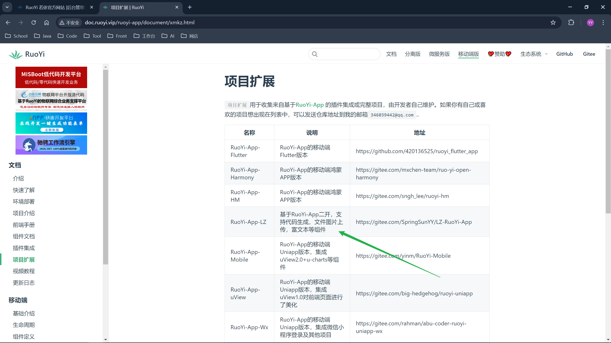

### 总结

​		通过本教程，你将逐步掌握Velocity模板引擎的使用技巧，学会如何通过Java代码生成基础的增删改查功能，并最终为若依APP构建代码生成器。教程中不仅涵盖了各步骤的理论知识，还包括了大量的实践操作和技巧，旨在帮助你提高开发效率，减少重复工作，成为更加高效的Java开发人员。


## 第一部分：Velocity模板引擎教程

### 一、常见的Java模板引擎

#### 1. **Velocity**

Velocity是一个轻量级的模板引擎，专为在Java项目中动态生成内容而设计。它被广泛用于生成HTML页面、XML文件、配置文件，尤其是在代码生成器领域。

**特点**：

- 语法简单，容易上手
- 高度可扩展，适合各种类型的模板生成需求
- 可与Java无缝集成，使用`VelocityContext`传递数据到模板中
- 性能较好，适合大型代码生成器的开发

**优点**：

- **广泛使用**：Velocity是成熟的技术，文档丰富，社区支持良好，在代码生成器领域应用广泛。
- **灵活性强**：其模板灵活性较强，可以适用于各种代码生成场景，比如生成Controller、Service、Mapper等层的代码。
- **与Java高度兼容**：Velocity与Java深度集成，通过简单的API即可将数据传递到模板中，从而生成Java代码。
- **学习曲线低**：相对简单的语法，使其更容易掌握，适合快速上手并应用在代码生成器中。

#### 2. **Freemarker**

Freemarker是另一个常用的Java模板引擎，专门设计用于生成文本（包括HTML、XML、Java代码等）。

**特点**：

- 强大的表达式语言，支持复杂的逻辑控制
- 比Velocity语法稍复杂，但功能更加丰富
- 有丰富的内置函数和控制指令

**优点**：

- **功能丰富**：Freemarker比Velocity提供更多的模板指令和内置函数，适合复杂模板的处理。
- **灵活的条件和循环控制**：Freemarker提供强大的控制结构（如条件语句和循环），可处理复杂的数据和逻辑。

**缺点**：

- **学习曲线较高**：相比Velocity，Freemarker的语法更加复杂，需要更多的时间去学习和理解。
- **性能稍逊**：在某些场景下，Freemarker的运行性能不如Velocity，特别是生成大量代码时。

#### 3. **Thymeleaf**

Thymeleaf主要用于生成动态HTML页面，适合Web应用中的视图层。

**特点**：

- 主要用于生成HTML、XML，不太适合Java代码生成
- 与Spring框架集成紧密，是Spring MVC的首选模板引擎

**优点**：

- **Web应用友好**：Thymeleaf在生成Web页面时非常高效，与前端代码结合紧密，适用于视图层的动态渲染。
- **易于调试**：由于Thymeleaf的模板在未渲染时也是合法的HTML文档，因此调试和设计更为简单。

**缺点**：

- **不适合代码生成器**：Thymeleaf的设计初衷是生成HTML，而不是Java代码，因此在代码生成器场景中，使用Thymeleaf显得不太合适。

### 二、为什么选择Velocity

选择Velocity作为Java代码生成器中的模板引擎，主要基于以下几个关键因素：

1. **简单且灵活的语法** Velocity的语法相对简单，容易学习和应用。它提供了一套基本的模板标记（如变量、条件、循环等），适合用于生成多种类型的代码模板。对于希望快速上手代码生成的开发者，Velocity的学习曲线低，非常适合初学者和团队使用。
2. **性能优异** 代码生成器通常需要处理大量模板文件，尤其是在生成多层结构的应用代码时（如Controller、Service、Mapper等）。Velocity的性能表现相对优秀，适合大规模代码生成任务。
3. **与Java的深度集成** Velocity与Java高度集成，开发者可以通过`VelocityContext`将Java对象传递给模板，从而在模板中动态生成代码。其无缝对接特性使得它非常适合用于基于Java的代码生成器。
4. **成熟且社区支持良好** Velocity作为一个成熟的模板引擎，有着丰富的文档和社区支持。无论是遇到问题，还是希望获取最佳实践，开发者都能轻松找到资源。同时，许多已有的代码生成器项目（如MyBatis Generator）也选择了Velocity作为其模板引擎，证明了其在该领域的实用性。
5. **轻量级和可扩展性** Velocity是一个轻量级引擎，易于集成到各种Java应用中。而且它高度可扩展，开发者可以自定义指令或函数，适应各种特殊场景的代码生成需求。
6. ***最最最重要因素**：因为若依的代码生成器的模版引擎是velocity，所以我们选择velocity。*


### 三、快速入门

#### 1. 需求

使用velocity定义一个html模板 , 将动态数据填充到模板中 , 形成一个完整的html页面。我们将在这个生成这个模版了解velocity的基本语法。

#### 2. 步骤分析

1. 创建项目(maven)
2. 引入依赖
3. 定义模板
4. 输出html


#### 3.代码实现

##### 3.1 创建Maven工程

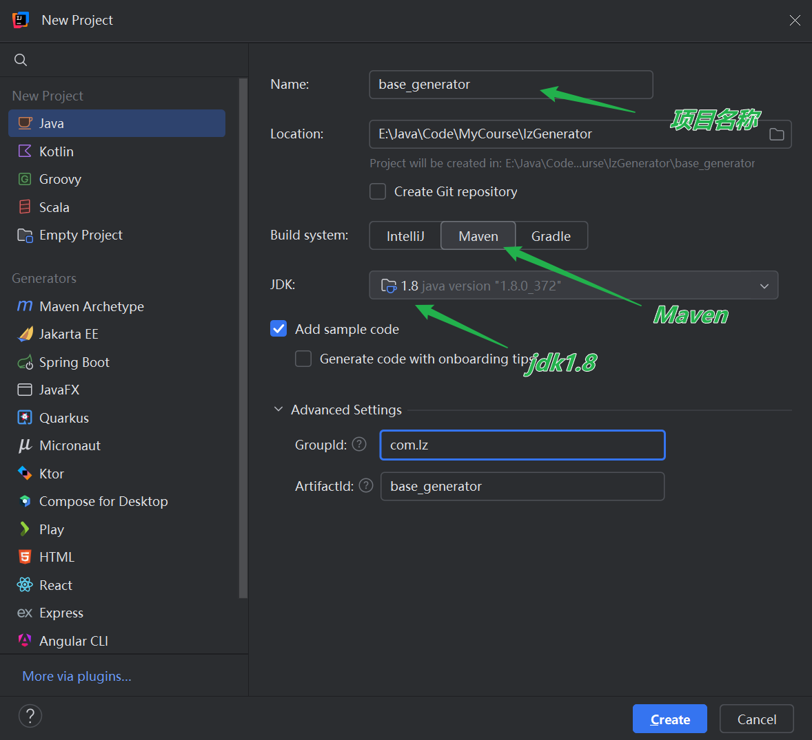


##### 3.2 引入坐标

首先引入坐标:

```xml
    <dependencies>
        <!-- 版本选择2.3 与若依一致 -->
        <dependency>
            <groupId>org.apache.velocity</groupId>
            <artifactId>velocity-engine-core</artifactId>
            <version>2.3</version>
        </dependency>
        <!--   hutool工具箱，操作文件     -->
        <!--  https://hutool.cn/docs/index.html#/ -->
        <dependency>
            <groupId>cn.hutool</groupId>
            <artifactId>hutool-all</artifactId>
            <version>5.8.8</version>
        </dependency>
    </dependencies>
```

##### 3.3 编写模板

在项目resources目录下创建vm\demo.html.vm文件

```html
<!DOCTYPE html>
<html lang="en">
<head>
    <meta charset="UTF-8">
    <title>Title</title>
</head>
<body>
 
hello , ${name} !
 
</body>
</html>
```

##### 3.4 输出结果

在Main.class下面新增方法，测试模版：

```java
public void test01() throws Exception {
        //设置velocity资源加载器
        Properties prop = new Properties();
        prop.put("file.resource.loader.class", "org.apache.velocity.runtime.resource.loader.ClasspathResourceLoader");
        Velocity.init(prop);

        //创建Velocity容器
        VelocityContext context = new VelocityContext();
        context.put("name", "荔枝");
        //加载模板
        Template tpl = Velocity.getTemplate("vm/demo.html.vm", "UTF-8");

        //文件输出位置
        String projectPath = System.getProperty("user.dir");
        String outputPath = projectPath + File.separator + "src" + File.separator + "main" + File.separator + "resources" + File.separator + "generated" + File.separator + "demo.html";
        // 创建文件对象
        File outputFile = new File(outputPath);

        // 创建目录
        File parentDir = outputFile.getParentFile();
        if (!parentDir.exists()) {
            parentDir.mkdirs();
        }

        // 创建文件写入器
        FileWriter fw = new FileWriter(outputFile);
        //合并数据到模板
        tpl.merge(context, fw);
        //释放资源
        fw.close();
    }
```

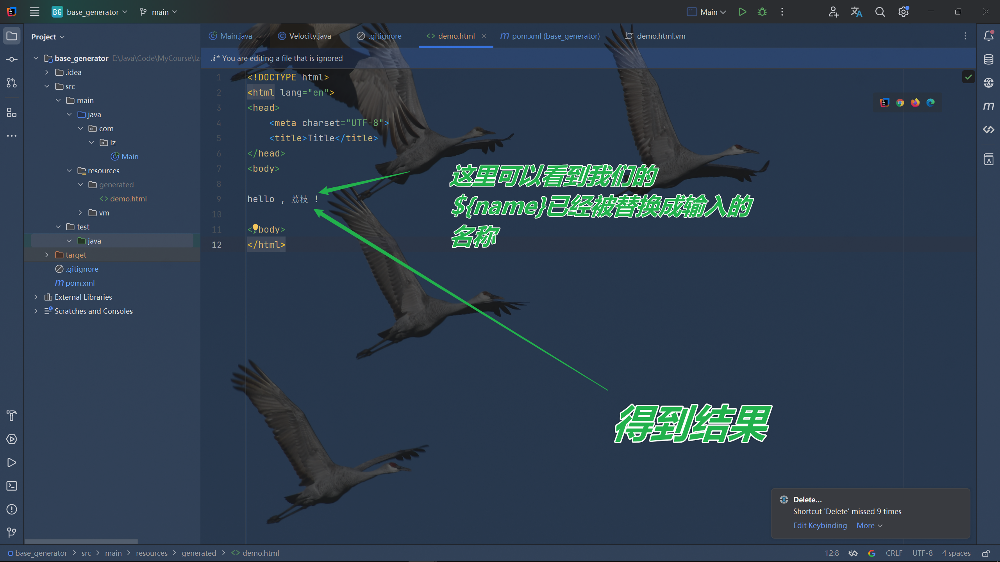

#### 4.运行原理

​		Velocity解决了如何在后台程序和网页之间传递数据的问题，后台代码和视图之间相互独立，一方的修改不影响另一方 .

​		他们之间是通过环境变量（Context）来实现的，网页制作一方和后台程序一方相互约定好对所传递变量的命名约定，比如上个程序例子中的site, name变量，它们在网页上就是$name ,$site 。

​		只要双方约定好了变量名字，那么双方就可以独立工作了。无论页面如何变化，只要变量名不变，那么后台程序就无需改动，前台网页也可以任意由网页制作人员修改。这就是Velocity的工作原理。

​		


### 四、基本语法

##### VTL 基本介绍

Velocity Template Language (VTL) 是Velocity模板引擎所使用的模板语言，用于定义模板的结构和逻辑控制，帮助开发人员动态生成内容。VTL 语法简单直观，可以通过占位符、变量、指令等实现动态内容生成。VTL 是Velocity的核心部分，支持从简单的文本替换到复杂的控制结构。

VTL的语句分为4大类：**注释** , **非解析内容** , **引用**和**指令**。

##### 1. **变量（Variables）**
VTL中的变量使用 `${}` 语法表示。通过将数据对象传递到`VelocityContext`，可以在模板中使用这些对象的属性或方法。

**示例**：

```java
#set($name = "荔枝1")
Hello, ${name}!
```
**输出**：

```
hello , 荔枝 !

Hello,荔枝1
```

这里的 `$name` 是一个变量，它的值被设置为 "荔枝1"，然后在模板中输出。

##### 2. **注释（Comments）**
VTL支持三种类型的注释：单行注释和多行注释。注释的内容不会出现在最终生成的代码中。

###### 单行注释：
```vtl
##因为刚才已经合并name
```

###### 多行注释：
```vtl
#*
 这里已经重新
 设置name
*#
```

###### 文档注释：

```
#**
文档注释内容1
文档注释内容2
*#
```

##### 3.**变量进阶**

###### 3.1.引用变量

引用语句就是对引擎上下文对象中的属性进行操作。语法方面分为常规语法($属性)和正规语法(${属性})。

**语法**：

```
$变量名, 若上下文中没有对应的变量，则输出字符串"$变量名"
${变量名},若上下文中没有对应的变量，则输出字符串"${变量名}" 
$!变量名, 若上下文中没有对应的变量，则输出空字符串"" 
$!{变量名}, 若上下文中没有对应的变量，则输出空字符串""
```

**示例**：

```html
<!DOCTYPE html>
<html lang="en">
<head>
    <meta charset="UTF-8">
    <title>Title</title>
</head>
<body>
    ##因为刚才已经合并name
hello , ${name}!
    #*
     这里已经重新
     设置name
    *#
###set($name="荔枝1")
##Hello,${name}
    #**
     文档注释内容1
     文档注释内容2
     *#
<h1>----------------------------</h1>
<h1>引用变量</h1>
常规用法：$name<br>
正规用法：${name}<br>

##如果获取的变量不存在，表达式会原样展示，如果不想展示，可以使用$!变量名
没有变量：${name1}<br>
常规用法：$name1<br>
常规用法：$!name<br>
正规用法：$!{name}<br>
</body>
</html>
```


###### 3.2.属性引用

属性引用可以把他理解为一个类的变量为public，直接调用这个变量或者理解为一个map类型，key——value。

**语法**：

```
$变量名.属性, 	若上下文中没有对应的变量，则输出字符串"$变量名.属性"
${变量名.属性}	若上下文中没有对应的变量，则输出字符串"${变量名.属性}"
$!变量名.属性	若上下文中没有对应的变量，则输出字符串""
$!{变量名.属性}	若上下文中没有对应的变量，则输出字符串""
```

**实现**：

首先创建一个用户类作为我们的变量：

```java
public class UserInfo {
    private String username;
    private String password;

    public String getUsername() {
        return username;
    }

    public void setUsername(String username) {
        this.username = username;
    }

    public String getPassword() {
        return password;
    }

    public void setPassword(String password) {
        this.password = password;
    }
}

```

在容器中添加用户信息：

```java
        //用户信息
        UserInfo userInfo = new UserInfo();
        userInfo.setUsername("YY");
        userInfo.setPassword("YYLZ");
        context.put("userInfo",userInfo);
```

**事例**：

```html
<h1>----------------------------</h1>
<h1>引用属性</h1>
常规语法 : $userInfo.username --- $userInfo.password
<br>
正规语法 : ${userInfo.username} --- ${userInfo.password}
```

###### 3.3.方法引用

方法引用实际就是指方法调用操作，关注点**返回值**和**参数** , 方法的返回值将输出到最终结果中，而他这个方法也就是你传入的变量所拥有的方法。

**语法**：

```
$变量名.方法([入参1[, 入参2]*]?), 常规写法
${变量名.方法([入参1[, 入参2]*]?)}, 正规写法
 
$!变量名.方法([入参1[, 入参2]*]?), 常规写法
$!{变量名.方法([入参1[, 入参2]*]?)}, 正规写法
```

**实现**：

```html
<h1>----------------------------</h1>
<h1>方法属性</h1>
<h2>判断常过来的name是否为空</h2>
${name.isEmpty()}<br>
<h2>根据,分割name</h2>
${name.split(",")}<br>
<h2>获取用户名</h2>
${userInfo.getUsername()}
</body>
```


##### 4. **指令**

指令主要用于定义重用模块、引入外部资源、流程控制。指令以 `#` 作为起始字符。

###### 4.1.set

`#set` 指令用于给变量赋值。你可以通过它来初始化或者更改变量的值。可以在页面中声明定义变量。

**语法**：

```
#set($变量 = 值)
```

**示例**：

```java
<h1>-------------------</h1>
<h1>指令</h1>
<h2>set定义</h2>

    #set($str = "hello world")
    #set($int = 1)
    #set($arr = [1,2])
    #set($boolean = true)
    #set($map = {"key1":"value1", "key2":"value2"})

    ## 在字符串中也可以引用之前定义过的变量
    #set($str2 = "$str , how are you !")
    #set($str3 = '$str , how are you !')

<h2>获取set指令定义的变量</h2>
str: ${str}<br>
int: ${int}<br>
arr: ${arr}<br>
boolean: ${boolean}<br>
mar: ${map.key1}--${map.key2}<br>
str2: ${str2}<br>
str3: ${str3}<br>
```
###### 4.2 **条件语句**

VTL支持条件语句，例如 `#if`、`#else` 和 `#elseif`，用于实现基本的逻辑判断。

**语法**：

```
#if(判断条件)
  .........
#elseif(判断条件)
  .........
#else
  .........
#end 
```

**示例**：

```java
<h2>------------------</h2>
<h2>条件语句</h2>
    #if(${name.isEmpty()})
    我没有名字<br>
    #elseif(!${name.isEmpty()})
    我的名字是：${name}
    #end
<br>
    #if(${userInfo.getPassword().equals("YYLZ")})
    密码正确
    #end
```
###### 4.3. **循环语句**
使用 `#foreach` 指令来遍历集合或数组，生成动态内容。可以用来遍历列表、数组等数据结构。

**格式：**

```
#foreach($item in $items)
    ..........
    [#break]
#end
```

$items : 需要遍历的对象或者集合

如果items的类型为map集合, 那么遍历的是map的value

$item : 变量名称, 代表遍历的每一项

#break : 退出循环

内置属性 :

$foreach.index : 获取遍历的索引 , 从0开始

$foreach.count : 获取遍历的次数 , 从1开始

hasNext()判断是否有下一个元素

**示例**（遍历数组）：

创建一个list数组来作为遍历数据：

```java
        //用户数组
        List<UserInfo> userInfoList = new ArrayList<>();
        for (int i = 0; i < 10; i++) {
            UserInfo info = new UserInfo();
            info.setUsername("荔枝"+i);
            info.setPassword("YY"+i);
            userInfoList.add(info);
        }
        context.put("userInfoList",userInfoList);
```
做一个表格来遍历userInfoList：

```html
<h2>------------------</h2>
<h2>循环</h2>
<h3>遍历数组</h3>
<table border="1px" align="left">
    <tr>
        <td>编号</td>
        <td>用户名</td>
        <td>密码</td>
        <td>操作</td>
    </tr>
    #foreach($user in $userInfoList)
        <tr>
            <td>${foreach.index}</td>
            <td>${user.username}</td>
            <td>${user.password}</td>
            <td>
                <a href="">编辑</a>
                <a href="">删除</a>
            </td>
        </tr>
    #end
</table>
```

**事例**（遍历map）：

```html
<h2>------------------</h2>
<h3>遍历map集合</h3>
<h4>遍历值</h4>
    #foreach($value in $map)
        $value<br>
    #end
<h2>------------------</h2>
<h3>遍历键值对</h3>
    #foreach($entry in $map.entrySet())
        $entry.key --- $entry.value<br>
    #end
```


###### 4.4.宏指令

**作用 :** 定义重用模块（可带参数）

**语法 :**

定义语法

```html
#macro(宏名 [$arg]?)
   .....
#end
```

**示例 :**

```html

    ##定义宏指令
    #macro(table $userList)
    <table border="1px" align="center">
        <tr>
            <td>编号</td>
            <td>用户名</td>
            <td>密码</td>
            <td>操作</td>
        </tr>
        #foreach($user in $userList)
            <tr>
                <td>${foreach.index}</td>
                <td>${user.username}</td>
                <td>${user.password}</td>
                <td>
                    <a href="">编辑</a>
                    <a href="">删除</a>
                </td>
            </tr>
        #end
    #end
    <h1 style="margin: auto; text-align: center">使用宏指令的事例--------------</h1>
    #table($userInfoList)
    #table($userInfoList)
```

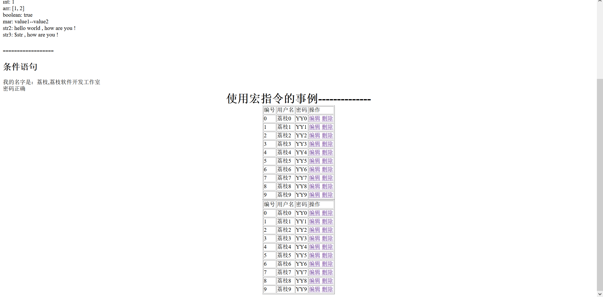

##### 5.引入资源

###### 5.1.#include

作用 : 引入外部资源 , 引入的资源不会被引擎所解析

**语法** : #include(resource)

- resource可以为**单引号或双引号的字符串**，也可以为**$变量**，内容为外部资源路径。
- 注意 : 路径如果为相对路径，则以引擎配置的文件加载器加载路径作为参考

**事例**：

​		首先创建一个文件在demo同级目录创建一个文件demo2.html.vm

```html
<!DOCTYPE html>
<html lang="en">
<head>
    <meta charset="UTF-8">
    <title>Title</title>
</head>
<body>
    ##因为刚才已经合并name
hello , ${name}!

</body>
</html>
```

```html
<h1>引入资源------------------</h1>
    ##    因为我们这里是使用文件加载器加载路径，所以需要和文件加载器路径保持一致
    #include("vm/demo2.html.vm")
```

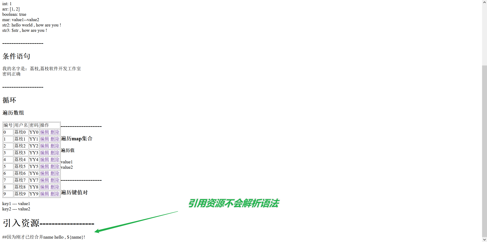


###### 5.2.\#parse

**作用 :** 引入外部资源 , 引入的资源将被引擎所解析

**语法 :** `#parse(resource)`

> - resource可以为**单引号或双引号的字符串**，也可以为**$变量**，内容为外部资源路径。
> - 注意 : 路径如果为相对路径，则以引擎配置的文件加载器加载路径作为参考系

**事例**：

```html
<h1>引入资源parse------------------</h1>
    #parse("vm/demo2.html.vm")
```

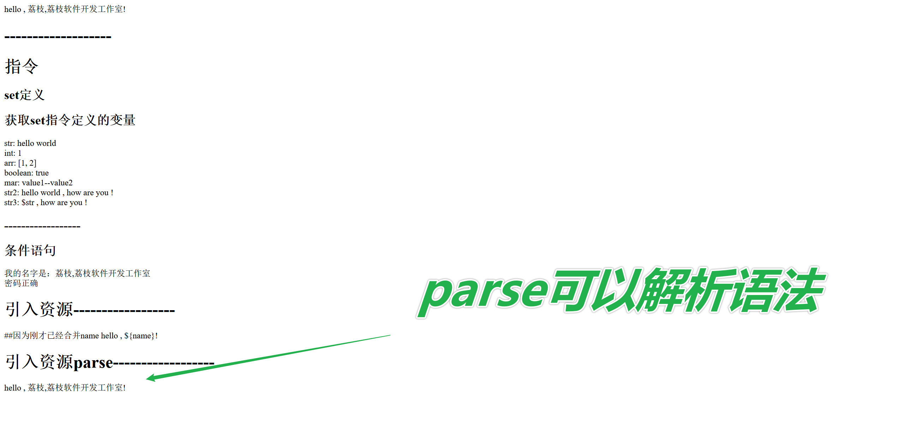


###### 5.3.\#define

**作用 :** `定义重用模块（不带参数）`

**语法 :**

```html
#define($模块名称)
	模块内容
#end
```

**事例**：

```html
#define($table)
##<h1>定义模块的事例--------------</h1>
<table border="1px" align="center" >
    <tr>
        <td>编号</td>
        <td>用户名</td>
        <td>密码</td>
        <td>操作</td>
    </tr>
    #foreach($user in $userInfoList)
        <tr>
            <td>${foreach.index}</td>
            <td>${user.username}</td>
            <td>${user.password}</td>
            <td>
                <a href="">编辑</a>
                <a href="">删除</a>
            </td>
        </tr>
    #end
</table>
#end
<h1 style="margin: auto; text-align: center">使用模块的事例--------------</h1>
$table
$table
```

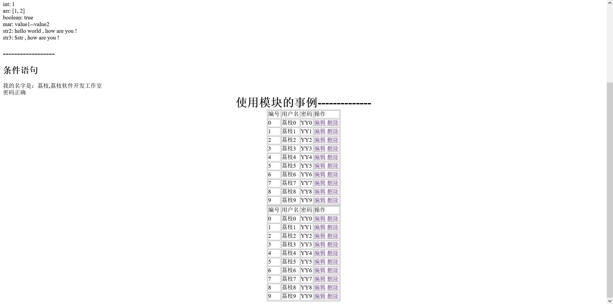


###### 5.4.\#evaluate

**作用 :** 动态计算 , 动态计算可以让我们在字符串中使用变量

**语法 :** `#evalute("计算语句")`

**示例 :**

```html
<h1 style="margin: auto; text-align: center">动态计算---------------</h1>
    #evaluate("#if($name=='YY') <h1>YY</h1>  #else
    <h1>荔枝</h1> #end")
```


### 总结

​		VTL 为我们提供了灵活且简洁的语法，用于生成动态的Java代码或其他文本格式。通过使用 VTL，让我们可以轻松定义模板逻辑、控制代码生成的流程，以及创建可复用的模板组件。Velocity作为一个轻量级、易用且扩展性强的模板引擎，广泛应用于代码生成器、Web页面生成和其他动态文本生成场景。

​		到此，我们第一部分也到此结束，接下来我们进入第二部分**Java生成基本的增删改查（CRUD）代码**。


## 第二部分：Java生成基本的增删改查（CRUD）代码

​		在Java开发中，手动编写代码是一项繁琐而耗时的任务。为了提高开发效率，许多Java代码生成器应运而生。这些工具可以根据预先定义的模板自动生成Java代码，从而减少了手动编写代码的工作量。


### 一、项目初始化

这次我们创建一个Spring Boot的项目，方便我们的的管理，也不需要去自己添加那么配置。

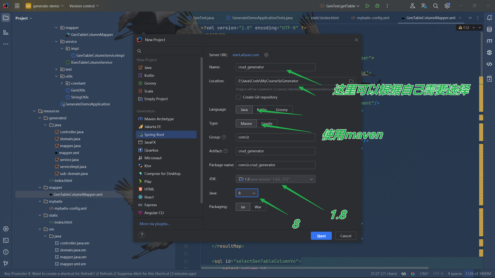

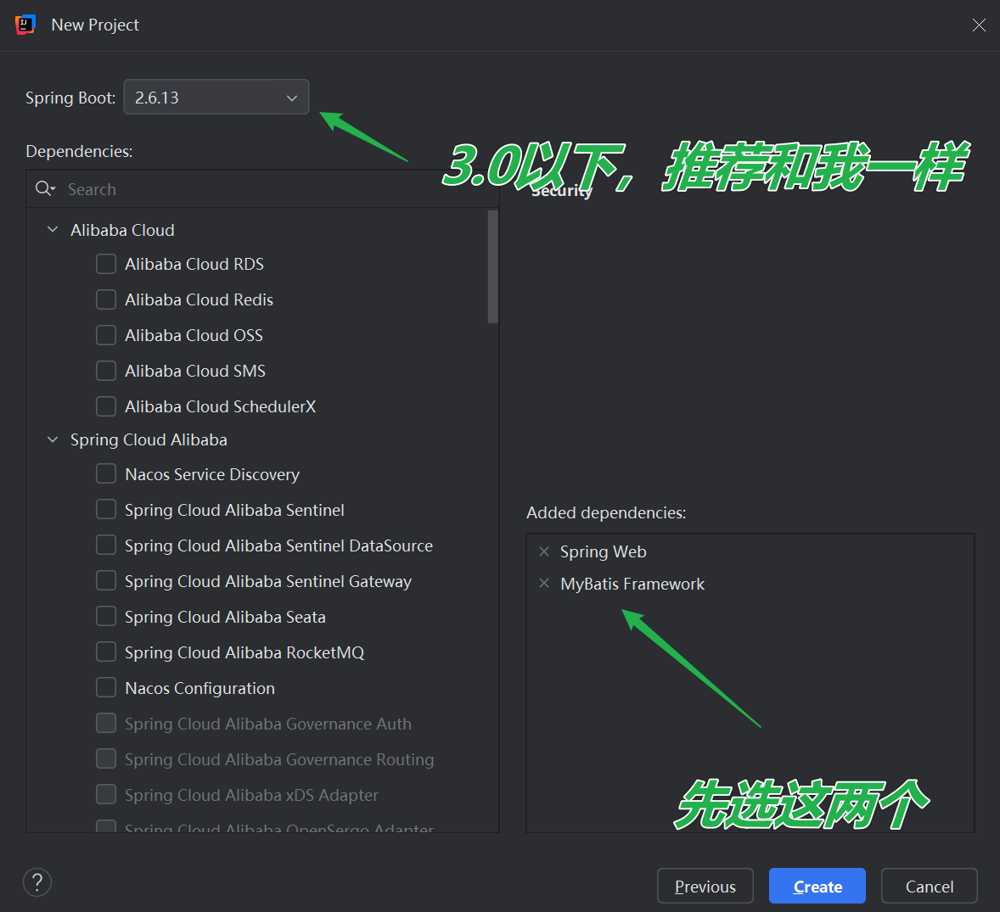

创建完成之后先把mybatis的依赖注释掉，保证我们能启动成功，启动后随便访问一个接口看是否能访问成功，可以访问成功则表示启动成功，或者查看控制台也可。

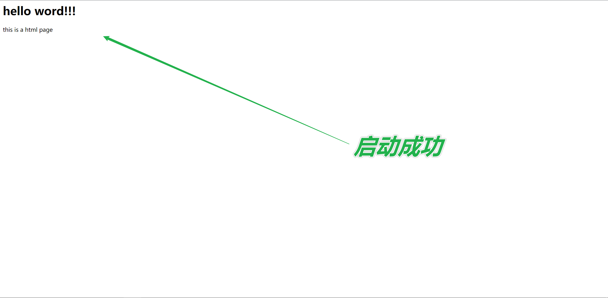

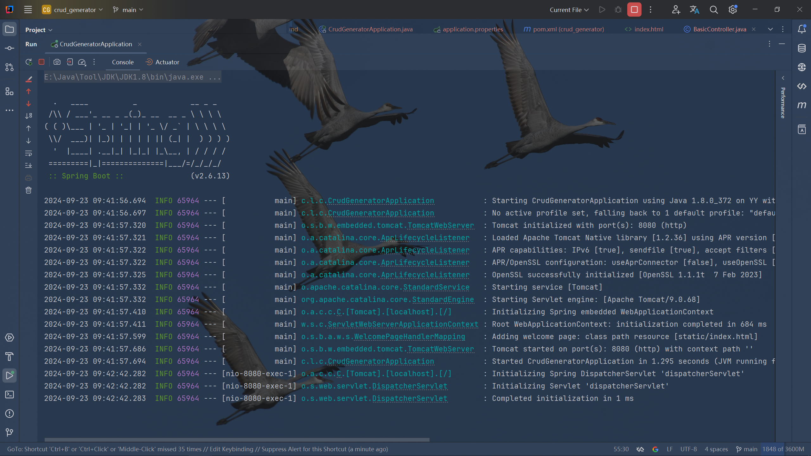


### 二、步骤分析

1. 获取数据库表字段信息：
   - 获取到数据库需要生成的表的基本信息，表名、列名称、数据类型、注释等等。
   - 编写对应实体。
   - 编写查询语句映射实体。
   - 编写具体功能。
2. 整合Velocity模版：
   - 项目整合Velocity模版，基本的工具类。
3. 编写基本的Velocity的生成模版生成代码：
   - 编写基本的crud的生成模版，合成为我们所需要的代码。
   - 优化代码生成功能。
4. 完善项目：
   - 完善项目，优化项目的功能，自己可以快速使用。
   - 理解项目扩展，项目的可扩展点。


### 三、数据库表信息

#### 1、测试表

​     代码生成肯定需要我们获取到数据库的表信息，这样才知道具体要生成的内容是什么，所以首先需要一张表来获取帮助我们理解表都有哪些信息。

​		以下使用一个简洁的图书信息表来作为我们的演示：

**图书信息表：book_info**

| 字段名        | 类型          | 键类型 | 描述     |
| ------------- | ------------- | ------ | -------- |
| book_id       | bigint        | 主键   | 自增     |
| book_name     | varchar(64)   |        | 图书名称 |
| book_author   | varchar(64)   |        | 作者     |
| book_total    | int           |        | 总数量   |
| book_price    | float（10,2） |        | 价格     |
| book_image    | varchar(2048) |        | 图片     |
| book_shelf_id | bigint        |        | 书架     |
| create_by     | varchar(64)   |        | 创建人   |
| is_delete     | boolan        |        | 删除     |
| create_time   | datetime      |        | 创建时间 |
| update_time   | datetime      |        | 更新时间 |

```sql
CREATE TABLE book_info (
    book_id BIGINT AUTO_INCREMENT PRIMARY KEY COMMENT '主键',
    book_name VARCHAR(64) NOT NULL COMMENT '图书名称',
    book_author VARCHAR(64) COMMENT '作者',
    book_total INT COMMENT '总数量',
    book_price FLOAT(10, 2) COMMENT '价格',
    book_image VARCHAR(2048) COMMENT '图片',
    book_shelf_id BIGINT COMMENT '书架',
    create_by VARCHAR(64) COMMENT '创建人',
    is_delete BOOLEAN DEFAULT FALSE COMMENT '删除标志',
    create_time DATETIME DEFAULT CURRENT_TIMESTAMP COMMENT '创建时间',
    update_time DATETIME DEFAULT CURRENT_TIMESTAMP ON UPDATE CURRENT_TIMESTAMP COMMENT '更新时间'
) COMMENT='图书信息表';

```


#### 2、获取表信息

​		获取表的信息，表的字段列信息。但是怎么获取呢，我也不知道，但是我们可以去问问ai教我们怎么获取表的信息。

##### 获取表字段信息

**具体操作**

**问**：

```txt
CREATE TABLE book_info (
    book_id BIGINT AUTO_INCREMENT PRIMARY KEY COMMENT '主键',
    book_name VARCHAR(64) NOT NULL COMMENT '图书名称',
    book_author VARCHAR(64) COMMENT '作者',
    book_total INT COMMENT '总数量',
    book_price FLOAT(10, 2) COMMENT '价格',
    book_image VARCHAR(2048) COMMENT '图片',
    book_shelf_id BIGINT COMMENT '书架',
    create_by VARCHAR(64) COMMENT '创建人',
    is_delete BOOLEAN DEFAULT FALSE COMMENT '删除标志',
    create_time DATETIME DEFAULT CURRENT_TIMESTAMP COMMENT '创建时间',
    update_time DATETIME DEFAULT CURRENT_TIMESTAMP ON UPDATE CURRENT_TIMESTAMP COMMENT '更新时间'
) COMMENT='图书信息表';，我这里有一份建表语句，我想通过sql查询，查询到这个表的基本信息，列信息
```

**回复**：

```sql
SELECT 
    COLUMN_NAME AS '列名',
    DATA_TYPE AS '数据类型',
    CHARACTER_MAXIMUM_LENGTH AS '字符最大长度',
    IS_NULLABLE AS '是否可为空',
    COLUMN_DEFAULT AS '默认值',
    COLUMN_COMMENT AS '列注释'
FROM 
    INFORMATION_SCHEMA.COLUMNS
WHERE 
    TABLE_NAME = 'book_info' 
    AND TABLE_SCHEMA = '你的数据库名';  -- 替换为你的数据库名

```

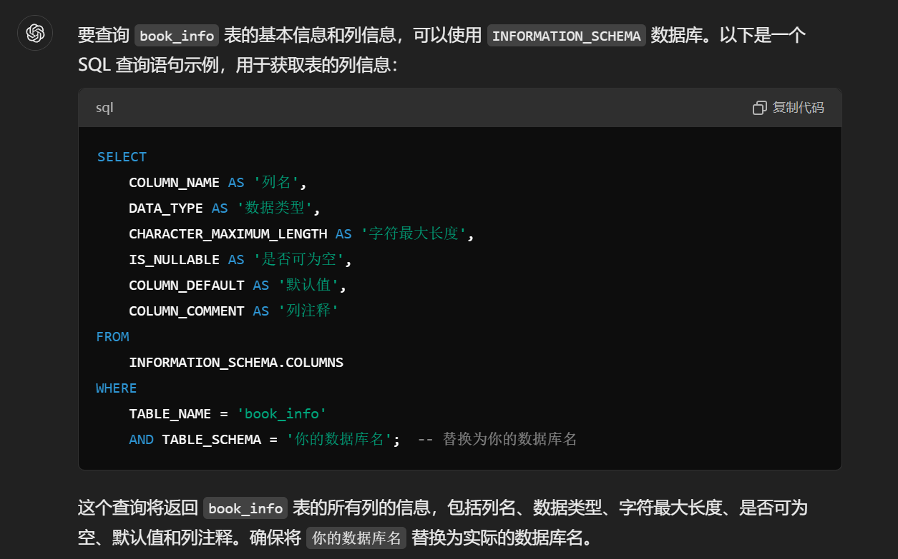

可以看到ai给的答复内容，根据此内容，可以查询到所有要的信息。

**INFORMATION_SCHEMA** 是一个系统数据库，存在于大多数关系型数据库管理系统（如 MySQL、PostgreSQL、SQL Server 等）中。它提供了一组只读的视图，用于查询数据库的元数据，包括数据库、表、列、索引、权限等信息。

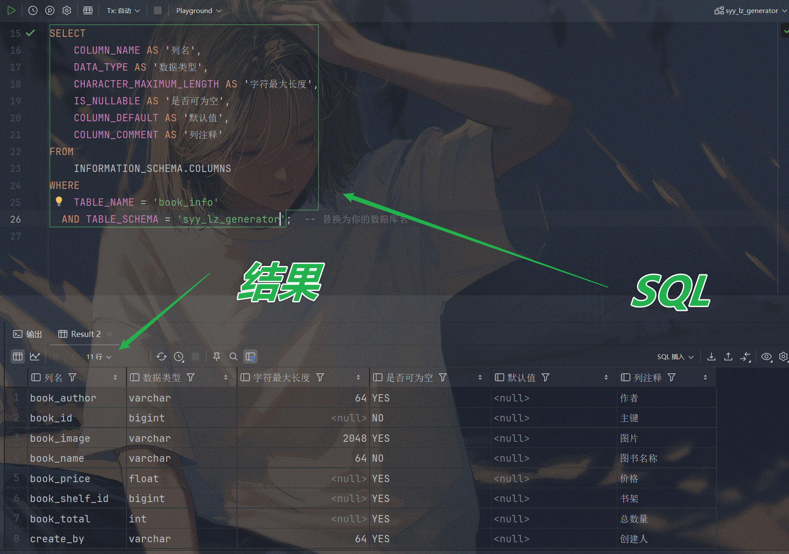

根据图片可以看到已经查到列名、数据类型、字符串最大长度、是否可为空、默认值和注释的信息，基本上已经满足我们所需要的信息，但是感觉还是有些不够，万一有些要用到呢，所以可以使用 " __*__ " 来查询，获取到所有的信息。 

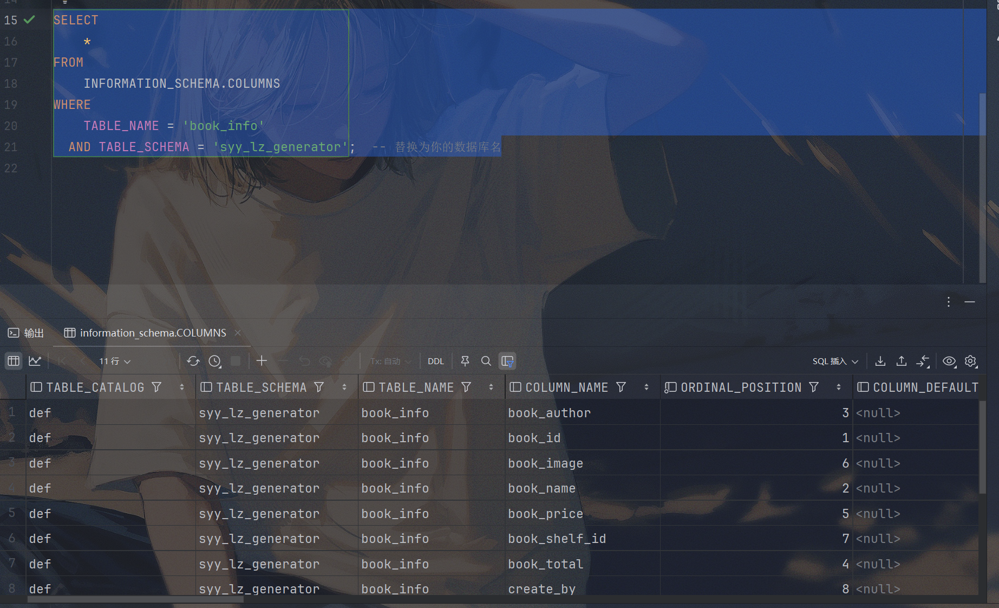

```sql
SELECT
    *
FROM
    INFORMATION_SCHEMA.COLUMNS
WHERE
    TABLE_NAME = 'book_info'
  AND TABLE_SCHEMA = 'syy_lz_generator';  -- 替换为你的数据库名
```

每个字段解释：

**TABLE_CATALOG**: 表示数据库的目录，通常在 MySQL 中会是数据库的名称。

**TABLE_SCHEMA**: 表示表所属的数据库（或模式）。

**TABLE_NAME**: 表示表的名称，与你查询的表名（`book_info`）一致。

**COLUMN_NAME**: 表示列的名称。

**ORDINAL_POSITION**: 表示列在表中的位置，从 1 开始的索引值。

**COLUMN_DEFAULT**: 表示列的默认值，如果没有设置默认值，则为 NULL。

**IS_NULLABLE**: 表示列是否可以为 NULL。值为 'YES' 表示可以为 NULL，'NO' 表示不可以。

**DATA_TYPE**: 表示列的数据类型，例如 `VARCHAR`, `INT`, `FLOAT`, `DATETIME` 等。

**CHARACTER_MAXIMUM_LENGTH**: 对于字符类型（如 `VARCHAR`），表示列的最大字符长度；对于非字符类型，此字段通常为 NULL。

**NUMERIC_PRECISION**: 对于数字类型（如 `FLOAT`, `DECIMAL`），表示数值的精度。

**NUMERIC_SCALE**: 对于数字类型，表示小数部分的位数。

**DATETIME_PRECISION**: 对于日期和时间类型，表示时间的精度（例如，毫秒）。

**CHARACTER_SET_NAME**: 表示字符集名称，通常用于字符类型的列。

**COLLATION_NAME**: 表示字符序列的排序规则，通常与字符集配合使用。

**COLUMN_TYPE**: 表示列的具体数据类型及其属性（例如，是否有长度限制、是否为自增等）。

**COLUMN_KEY**: 表示列的键类型，如 `PRI`（主键）、`UNI`（唯一键）、`MUL`（普通索引）。

**EXTRA**: 额外的属性信息，例如 `auto_increment`。

**PRIVILEGES**: 表示列的权限设置，例如 `select`, `insert`, `update` 等。

**COLUMN_COMMENT**: 表示列的注释信息，通常用于描述列的用途。


这样我们就可以直接使用as来辅助查询：

```sql
SELECT
    TABLE_CATALOG AS '数据库目录',
    TABLE_SCHEMA AS '数据库名',
    TABLE_NAME AS '表名',
    COLUMN_NAME AS '列名',
    ORDINAL_POSITION AS '列位置',
    COLUMN_DEFAULT AS '默认值',
    IS_NULLABLE AS '是否可为空',
    DATA_TYPE AS '数据类型',
    CHARACTER_MAXIMUM_LENGTH AS '字符最大长度',
    NUMERIC_PRECISION AS '数值精度',
    NUMERIC_SCALE AS '数值小数位数',
    DATETIME_PRECISION AS '日期时间精度',
    CHARACTER_SET_NAME AS '字符集名称',
    COLLATION_NAME AS '排序规则',
    COLUMN_TYPE AS '列类型',
    COLUMN_KEY AS '键类型',
    EXTRA AS '额外信息',
    PRIVILEGES AS '权限',
    COLUMN_COMMENT AS '列注释'
FROM
    INFORMATION_SCHEMA.COLUMNS
WHERE
    TABLE_NAME = 'book_info'
  AND TABLE_SCHEMA = 'syy_lz_generator';  -- 替换为你的数据库名

```


##### 获取表信息

```sql
SELECT TABLE_CATALOG   AS '数据库目录',
       TABLE_SCHEMA    AS '数据库名',
       TABLE_NAME      AS '表名',
       TABLE_TYPE      AS '表类型',
       ENGINE          AS '存储引擎',
       VERSION         AS '版本',
       ROW_FORMAT      AS '行格式',
       TABLE_ROWS      AS '表行数',
       AVG_ROW_LENGTH  AS '平均行长度',
       DATA_LENGTH     AS '数据长度',
       MAX_DATA_LENGTH AS '最大数据长度',
       INDEX_LENGTH    AS '索引长度',
       DATA_FREE       AS '空闲空间',
       AUTO_INCREMENT  AS '自增值',
       CREATE_TIME     AS '创建时间',
       UPDATE_TIME     AS '更新时间',
       CHECK_TIME      AS '检查时间',
       TABLE_COLLATION AS '表字符集',
       CREATE_OPTIONS  AS '创建选项',
       TABLE_COMMENT   AS '表注释'
FROM INFORMATION_SCHEMA.TABLES
WHERE TABLE_NAME = 'book_info'
  AND TABLE_SCHEMA = 'syy_lz_generator'; -- 替换为你的数据库名
```

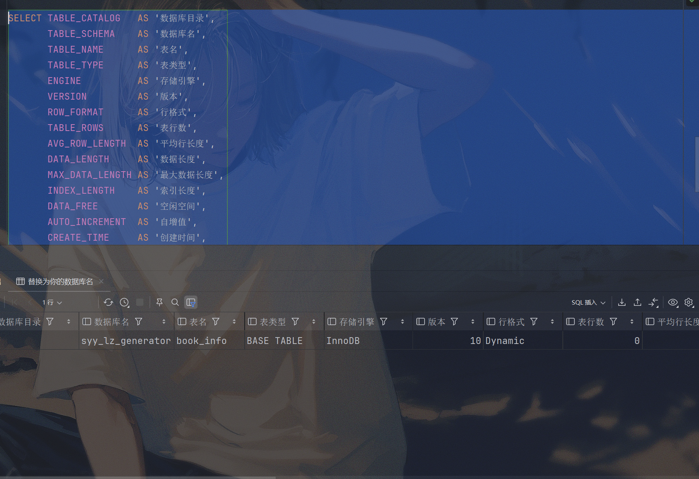

通过这些信息，可以了解到一张表的全貌，这样就方便我们生成代码了。既然知道了表的基本信息，那么我们就可以生成Java实体和对应的功能了。

#### 3、Java实体

需要创建两个实体，一个实体来记录每一列信息，一个实体来记录表名称、和生成的信息，因为根据查询到的数据来看，每一个返回的值都有表名、数据库名等公共信息，可以给他们提出来，一些不需要的信息我们也不需要返回了，对我们的功能没用。

**GenTable**

```java
public class GenTable {
    public String tableName;              // 表名
    public String tableComment;           // 表注释
    private String className;             // 实体类名称(首字母大写)
    private String packageName;           // 生成包路径
    private String author;                // 作者
    private List<GenTableColumn> columns; // 列表信息
    private String isPk;                  // 主键
    private static final long serialVersionUID = 1L;

    public String getTableName() {
        return tableName;
    }

    public void setTableName(String tableName) {
        this.tableName = tableName;
    }

    public String getTableComment() {
        return tableComment;
    }

    public void setTableComment(String tableComment) {
        this.tableComment = tableComment;
    }

    public String getClassName() {
        return className;
    }

    public void setClassName(String className) {
        this.className = className;
    }

    public String getPackageName() {
        return packageName;
    }

    public void setPackageName(String packageName) {
        this.packageName = packageName;
    }

    public String getAuthor() {
        return author;
    }

    public void setAuthor(String author) {
        this.author = author;
    }

    public List<GenTableColumn> getColumns() {
        return columns;
    }

    public void setColumns(List<GenTableColumn> columns) {
        this.columns = columns;
    }

    public String getIsPk() {
        return isPk;
    }

    public void setIsPk(String isPk) {
        this.isPk = isPk;
    }

    @Override
    public String toString() {
        return "GenTable{" +
                "tableName='" + tableName + '\'' +
                ", tableComment='" + tableComment + '\'' +
                ", className='" + className + '\'' +
                ", packageName='" + packageName + '\'' +
                ", author='" + author + '\'' +
                ", columns=" + columns +
                ", isPk='" + isPk + '\'' +
                '}';
    }
}

```


**GenTableColumn**

```java
public class GenTableColumn {
    public String columnName;                // 列名
    public String dataType;                  // 数据类型
    public String columnType;                // 列类型
    public String columnComment;             // 列注释
    private String isPk;                     // 主键
    private String columnKey;                // 键类型
    private String isNullable;               // 是否可为空
    private String javaType;                 // Java类型
    private String javaField;                // Java字段
    private static final long serialVersionUID = 1L;

    public String getColumnName() {
        return columnName;
    }

    public void setColumnName(String columnName) {
        this.columnName = columnName;
    }

    public String getDataType() {
        return dataType;
    }

    public void setDataType(String dataType) {
        this.dataType = dataType;
    }

    public String getColumnType() {
        return columnType;
    }

    public void setColumnType(String columnType) {
        this.columnType = columnType;
    }

    public String getColumnComment() {
        return columnComment;
    }

    public void setColumnComment(String columnComment) {
        this.columnComment = columnComment;
    }

    public String getIsPk() {
        return isPk;
    }

    public void setIsPk(String isPk) {
        this.isPk = isPk;
    }

    public String getColumnKey() {
        return columnKey;
    }

    public void setColumnKey(String columnKey) {
        this.columnKey = columnKey;
    }

    public String getIsNullable() {
        return isNullable;
    }

    public void setIsNullable(String isNullable) {
        this.isNullable = isNullable;
    }

    public String getJavaType() {
        return javaType;
    }

    public void setJavaType(String javaType) {
        this.javaType = javaType;
    }

    public String getJavaField() {
        return javaField;
    }

    public void setJavaField(String javaField) {
        this.javaField = javaField;
    }

    @Override
    public String toString() {
        return "\nGenTableColumn{" +
                "columnName='" + columnName + '\'' +
                ", dataType='" + dataType + '\'' +
                ", columnType='" + columnType + '\'' +
                ", columnComment='" + columnComment + '\'' +
                ", isPk='" + isPk + '\'' +
                ", columnKey='" + columnKey + '\'' +
                ", isNullable='" + isNullable + '\'' +
                ", javaType='" + javaType + '\'' +
                ", javaField='" + javaField + '\'' +
                '}';
    }
}

```


#### 4、映射实体

1、首先加**pom依赖、mybatis和yml**的配置：

```xml
    <properties>
        <java.version>1.8</java.version>
        <project.build.sourceEncoding>UTF-8</project.build.sourceEncoding>
        <project.reporting.outputEncoding>UTF-8</project.reporting.outputEncoding>
        <spring-boot.version>2.6.13</spring-boot.version>
        <fastjson.version>2.0.43</fastjson.version>
        <velocity.version>2.3</velocity.version>
        <druid.version>1.2.20</druid.version>
        <hutool.version>5.8.8</hutool.version>
    </properties>
    <dependencies>
        <dependency>
            <groupId>org.springframework.boot</groupId>
            <artifactId>spring-boot-starter-web</artifactId>
        </dependency>
        <dependency>
            <groupId>org.springframework.boot</groupId>
            <artifactId>spring-boot-starter-test</artifactId>
            <scope>test</scope>
        </dependency>
        <dependency>
            <groupId>org.mybatis.spring.boot</groupId>
            <artifactId>mybatis-spring-boot-starter</artifactId>
            <version>2.2.2</version>
        </dependency>
        <dependency>
            <groupId>org.springframework.boot</groupId>
            <artifactId>spring-boot-starter-jdbc</artifactId>
        </dependency>
        <dependency>
            <groupId>mysql</groupId>
            <artifactId>mysql-connector-java</artifactId>
        </dependency>
        <!-- velocity代码生成使用模板 -->
        <dependency>
            <groupId>org.apache.velocity</groupId>
            <artifactId>velocity-engine-core</artifactId>
            <version>${velocity.version}</version>
        </dependency>
        <!-- 阿里JSON解析器 -->
        <dependency>
            <groupId>com.alibaba.fastjson2</groupId>
            <artifactId>fastjson2</artifactId>
            <version>${fastjson.version}</version>
        </dependency>
        <!-- 阿里数据库连接池 -->
        <dependency>
            <groupId>com.alibaba</groupId>
            <artifactId>druid-spring-boot-starter</artifactId>
            <version>${druid.version}</version>
        </dependency>
        <!--  hutool工具箱，操作文件 -->
        <!--  https://hutool.cn/docs/index.html#/ -->
        <dependency>
            <groupId>cn.hutool</groupId>
            <artifactId>hutool-all</artifactId>
            <version>${hutool.version}</version>
        </dependency>
    </dependencies>
```

mybatis-config.xml

```xml
<?xml version="1.0" encoding="UTF-8" ?>
<!DOCTYPE configuration
PUBLIC "-//mybatis.org//DTD Config 3.0//EN"
"http://mybatis.org/dtd/mybatis-3-config.dtd">
<configuration>
    <!-- 全局参数 -->
    <settings>
        <!-- 使全局的映射器启用或禁用缓存 -->
        <setting name="cacheEnabled"             value="true"   />
        <!-- 允许JDBC 支持自动生成主键 -->
        <setting name="useGeneratedKeys"         value="true"   />
        <!-- 配置默认的执行器.SIMPLE就是普通执行器;REUSE执行器会重用预处理语句(prepared statements);BATCH执行器将重用语句并执行批量更新 -->
        <setting name="defaultExecutorType"      value="SIMPLE" />
		<!-- 指定 MyBatis 所用日志的具体实现 -->
        <setting name="logImpl"                  value="SLF4J"  />
        <!-- 使用驼峰命名法转换字段 -->
		<!-- <setting name="mapUnderscoreToCamelCase" value="true"/> -->
	</settings>
</configuration>

```

yml

```yml
# 开发环境配置
server:
  # 服务器的HTTP端口，默认为8080
  port: 8080

# 数据源配置
spring:
  datasource:
    type: com.alibaba.druid.pool.DruidDataSource
    driverClassName: com.mysql.cj.jdbc.Driver
    url: jdbc:mysql://localhost:3306/syy_lz_generator?useUnicode=true&characterEncoding=utf8&zeroDateTimeBehavior=convertToNull&useSSL=true&serverTimezone=GMT%2B8
    username: root
    password: yy0908..

# MyBatis配置
mybatis:
  # 搜索指定包别名
  typeAliasesPackage: com.lz.**.model
  # 配置mapper的扫描，找到所有的mapper.xml映射文件
  mapperLocations: classpath*:mapper/**/*Mapper.xml
  # 加载全局的配置文件
  configLocation: classpath:mybatis/mybatis-config.xml

```

2、**编写Mapper***，查询字段信息：

GenTableColumnMapper：

```java
@Mapper
public interface GenTableColumnMapper {
    List<GenTableColumn> selectTableByTableName(String tableName);
}
```

GenTableMapper:

```xml
@Mapper
public interface GenTableMapper {
    GenTable selectTableByTableName(@Param("tableName") String tableName);
}
```

GenTableColumnMapper.xml：

```xml
<?xml version="1.0" encoding="UTF-8" ?>
<!DOCTYPE mapper PUBLIC "-//mybatis.org//DTD Mapper 3.0//EN" "http://mybatis.org/dtd/mybatis-3-mapper.dtd">

<mapper namespace="com.lz.crud_generator.mapper.GenTableColumnMapper">

    <!-- resultMap 定义，映射到 BookInfoTableMetadata 类 -->
    <resultMap type="GenTableColumn" id="TableColumnResult">
        <result property="columnName" column="COLUMN_NAME"/>
        <result property="isNullable" column="IS_NULLABLE"/>
        <result property="dataType" column="DATA_TYPE"/>
        <result property="columnType" column="COLUMN_TYPE"/>
        <result property="columnKey" column="COLUMN_KEY"/>
        <result property="columnComment" column="COLUMN_COMMENT"/>
    </resultMap>

    <!-- SQL 查询语句，返回表的元数据 -->
    <sql id="selectTableColumn">
        SELECT
            TABLE_CATALOG,
            TABLE_SCHEMA,
            TABLE_NAME,
            COLUMN_NAME,
            ORDINAL_POSITION,
            COLUMN_DEFAULT,
            IS_NULLABLE,
            DATA_TYPE,
            CHARACTER_MAXIMUM_LENGTH,
            NUMERIC_PRECISION,
            NUMERIC_SCALE,
            DATETIME_PRECISION,
            CHARACTER_SET_NAME,
            COLLATION_NAME,
            COLUMN_TYPE,
            COLUMN_KEY,
            EXTRA,
            PRIVILEGES,
            COLUMN_COMMENT
        FROM
            INFORMATION_SCHEMA.COLUMNS
    </sql>

    <!-- 使用 select 语句并映射到 resultMap -->
    <select id="selectTableByTableName" resultMap="TableColumnResult" parameterType="string">
        <include refid="selectTableColumn"/>
        WHERE TABLE_NAME = #{tableName}
        AND TABLE_SCHEMA = (select database()); -- 替换为你的数据库名
    </select>
</mapper>

```

GenTableMapper.xml:

```xml
<?xml version="1.0" encoding="UTF-8" ?>
<!DOCTYPE mapper PUBLIC "-//mybatis.org//DTD Mapper 3.0//EN" "http://mybatis.org/dtd/mybatis-3-mapper.dtd">

<mapper namespace="com.lz.crud_generator.mapper.GenTableMapper">

    <!-- resultMap 定义，映射到 BookInfoTableMetadata 类 -->
    <resultMap type="GenTable" id="TableResult">
        <id property="tableName" column="TABLE_NAME"/>
        <result property="tableComment" column="TABLE_COMMENT"/>
    </resultMap>

    <!-- SQL 查询语句，返回表的元数据 -->
    <sql id="selectTable">
        SELECT
            TABLE_NAME,
            TABLE_COMMENT
        FROM
            INFORMATION_SCHEMA.TABLES
    </sql>

    <select id="selectTableByTableName" resultMap="TableResult">
        <include refid="selectTable"/>
        WHERE TABLE_NAME = #{tableName}
        AND TABLE_SCHEMA = (select database()); -- 替换为你的数据库名
    </select>

</mapper>

```

3、**编写测试类**：

```java
@SpringBootTest
public class genTableTest {
    @Autowired
    public GenTableColumnMapper genTableColumnMapper;

    @Test
    void getTableInfo(){
        List<GenTableColumn> genTableColumns = genTableColumnMapper.selectTableByTableName("book_info");
        for (GenTableColumn genTableColumn : genTableColumns) {
            System.out.println("genTableColumn = " + genTableColumn);
        }
    }
}
```

4、**运行**

运行测试方法得到结果如图所示：


#### 5、具体功能

##### 5.1、复制String工具类

```java
package com.lz.crud_generator.utils;

import org.springframework.util.AntPathMatcher;

import java.util.*;

/**
 * 字符串工具类
 */
public class MyStrUtils extends org.apache.commons.lang3.StringUtils {
    /**
     * 空字符串
     */
    private static final String NULLSTR = "";

    /**
     * 下划线
     */
    private static final char SEPARATOR = '_';

    /**
     * 星号
     */
    private static final char ASTERISK = '*';

    /**
     * 获取参数不为空值
     *
     * @param value defaultValue 要判断的value
     * @return value 返回值
     */
    public static <T> T nvl(T value, T defaultValue) {
        return value != null ? value : defaultValue;
    }

    /**
     * * 判断一个Collection是否为空， 包含List，Set，Queue
     *
     * @param coll 要判断的Collection
     * @return true：为空 false：非空
     */
    public static boolean isEmpty(Collection<?> coll) {
        return isNull(coll) || coll.isEmpty();
    }

    /**
     * * 判断一个Collection是否非空，包含List，Set，Queue
     *
     * @param coll 要判断的Collection
     * @return true：非空 false：空
     */
    public static boolean isNotEmpty(Collection<?> coll) {
        return !isEmpty(coll);
    }

    /**
     * * 判断一个对象数组是否为空
     *
     * @param objects 要判断的对象数组
     *                * @return true：为空 false：非空
     */
    public static boolean isEmpty(Object[] objects) {
        return isNull(objects) || (objects.length == 0);
    }

    /**
     * * 判断一个对象数组是否非空
     *
     * @param objects 要判断的对象数组
     * @return true：非空 false：空
     */
    public static boolean isNotEmpty(Object[] objects) {
        return !isEmpty(objects);
    }

    /**
     * * 判断一个Map是否为空
     *
     * @param map 要判断的Map
     * @return true：为空 false：非空
     */
    public static boolean isEmpty(Map<?, ?> map) {
        return isNull(map) || map.isEmpty();
    }

    /**
     * * 判断一个Map是否为空
     *
     * @param map 要判断的Map
     * @return true：非空 false：空
     */
    public static boolean isNotEmpty(Map<?, ?> map) {
        return !isEmpty(map);
    }

    /**
     * * 判断一个字符串是否为空串
     *
     * @param str String
     * @return true：为空 false：非空
     */
    public static boolean isEmpty(String str) {
        return isNull(str) || NULLSTR.equals(str.trim());
    }

    /**
     * * 判断一个字符串是否为非空串
     *
     * @param str String
     * @return true：非空串 false：空串
     */
    public static boolean isNotEmpty(String str) {
        return !isEmpty(str);
    }

    /**
     * * 判断一个对象是否为空
     *
     * @param object Object
     * @return true：为空 false：非空
     */
    public static boolean isNull(Object object) {
        return object == null;
    }

    /**
     * * 判断一个对象是否非空
     *
     * @param object Object
     * @return true：非空 false：空
     */
    public static boolean isNotNull(Object object) {
        return !isNull(object);
    }

    /**
     * * 判断一个对象是否是数组类型（Java基本型别的数组）
     *
     * @param object 对象
     * @return true：是数组 false：不是数组
     */
    public static boolean isArray(Object object) {
        return isNotNull(object) && object.getClass().isArray();
    }

    /**
     * 去空格
     */
    public static String trim(String str) {
        return (str == null ? "" : str.trim());
    }

    /**
     * 替换指定字符串的指定区间内字符为"*"
     *
     * @param str          字符串
     * @param startInclude 开始位置（包含）
     * @param endExclude   结束位置（不包含）
     * @return 替换后的字符串
     */
    public static String hide(CharSequence str, int startInclude, int endExclude) {
        if (isEmpty(str)) {
            return NULLSTR;
        }
        final int strLength = str.length();
        if (startInclude > strLength) {
            return NULLSTR;
        }
        if (endExclude > strLength) {
            endExclude = strLength;
        }
        if (startInclude > endExclude) {
            // 如果起始位置大于结束位置，不替换
            return NULLSTR;
        }
        final char[] chars = new char[strLength];
        for (int i = 0; i < strLength; i++) {
            if (i >= startInclude && i < endExclude) {
                chars[i] = ASTERISK;
            } else {
                chars[i] = str.charAt(i);
            }
        }
        return new String(chars);
    }

    /**
     * 截取字符串
     *
     * @param str   字符串
     * @param start 开始
     * @return 结果
     */
    public static String substring(final String str, int start) {
        if (str == null) {
            return NULLSTR;
        }

        if (start < 0) {
            start = str.length() + start;
        }

        if (start < 0) {
            start = 0;
        }
        if (start > str.length()) {
            return NULLSTR;
        }

        return str.substring(start);
    }

    /**
     * 截取字符串
     *
     * @param str   字符串
     * @param start 开始
     * @param end   结束
     * @return 结果
     */
    public static String substring(final String str, int start, int end) {
        if (str == null) {
            return NULLSTR;
        }

        if (end < 0) {
            end = str.length() + end;
        }
        if (start < 0) {
            start = str.length() + start;
        }

        if (end > str.length()) {
            end = str.length();
        }

        if (start > end) {
            return NULLSTR;
        }

        if (start < 0) {
            start = 0;
        }
        if (end < 0) {
            end = 0;
        }

        return str.substring(start, end);
    }

    /**
     * 判断是否为空，并且不是空白字符
     *
     * @param str 要判断的value
     * @return 结果
     */
    public static boolean hasText(String str) {
        return (str != null && !str.isEmpty() && containsText(str));
    }

    private static boolean containsText(CharSequence str) {
        int strLen = str.length();
        for (int i = 0; i < strLen; i++) {
            if (!Character.isWhitespace(str.charAt(i))) {
                return true;
            }
        }
        return false;
    }


    /**
     * 字符串转set
     *
     * @param str 字符串
     * @param sep 分隔符
     * @return set集合
     */
    public static final Set<String> str2Set(String str, String sep) {
        return new HashSet<String>(str2List(str, sep, true, false));
    }

    /**
     * 字符串转list
     *
     * @param str         字符串
     * @param sep         分隔符
     * @param filterBlank 过滤纯空白
     * @param trim        去掉首尾空白
     * @return list集合
     */
    public static final List<String> str2List(String str, String sep, boolean filterBlank, boolean trim) {
        List<String> list = new ArrayList<String>();
        if (com.yy.generate.utils.MyStrUtils.isEmpty(str)) {
            return list;
        }

        // 过滤空白字符串
        if (filterBlank && com.yy.generate.utils.MyStrUtils.isBlank(str)) {
            return list;
        }
        String[] split = str.split(sep);
        for (String string : split) {
            if (filterBlank && com.yy.generate.utils.MyStrUtils.isBlank(string)) {
                continue;
            }
            if (trim) {
                string = string.trim();
            }
            list.add(string);
        }

        return list;
    }

    /**
     * 判断给定的collection列表中是否包含数组array 判断给定的数组array中是否包含给定的元素value
     *
     * @param collection 给定的集合
     * @param array      给定的数组
     * @return boolean 结果
     */
    public static boolean containsAny(Collection<String> collection, String... array) {
        if (isEmpty(collection) || isEmpty(array)) {
            return false;
        } else {
            for (String str : array) {
                if (collection.contains(str)) {
                    return true;
                }
            }
            return false;
        }
    }

    /**
     * 查找指定字符串是否包含指定字符串列表中的任意一个字符串同时串忽略大小写
     *
     * @param cs                  指定字符串
     * @param searchCharSequences 需要检查的字符串数组
     * @return 是否包含任意一个字符串
     */
    public static boolean containsAnyIgnoreCase(CharSequence cs, CharSequence... searchCharSequences) {
        if (isEmpty(cs) || isEmpty(searchCharSequences)) {
            return false;
        }
        for (CharSequence testStr : searchCharSequences) {
            if (containsIgnoreCase(cs, testStr)) {
                return true;
            }
        }
        return false;
    }

    /**
     * 驼峰转下划线命名
     */
    public static String toUnderScoreCase(String str) {
        if (str == null) {
            return null;
        }
        StringBuilder sb = new StringBuilder();
        // 前置字符是否大写
        boolean preCharIsUpperCase = true;
        // 当前字符是否大写
        boolean curreCharIsUpperCase = true;
        // 下一字符是否大写
        boolean nexteCharIsUpperCase = true;
        for (int i = 0; i < str.length(); i++) {
            char c = str.charAt(i);
            if (i > 0) {
                preCharIsUpperCase = Character.isUpperCase(str.charAt(i - 1));
            } else {
                preCharIsUpperCase = false;
            }

            curreCharIsUpperCase = Character.isUpperCase(c);

            if (i < (str.length() - 1)) {
                nexteCharIsUpperCase = Character.isUpperCase(str.charAt(i + 1));
            }

            if (preCharIsUpperCase && curreCharIsUpperCase && !nexteCharIsUpperCase) {
                sb.append(SEPARATOR);
            } else if ((i != 0 && !preCharIsUpperCase) && curreCharIsUpperCase) {
                sb.append(SEPARATOR);
            }
            sb.append(Character.toLowerCase(c));
        }

        return sb.toString();
    }

    /**
     * 是否包含字符串
     *
     * @param str  验证字符串
     * @param strs 字符串组
     * @return 包含返回true
     */
    public static boolean inStringIgnoreCase(String str, String... strs) {
        if (str != null && strs != null) {
            for (String s : strs) {
                if (str.equalsIgnoreCase(trim(s))) {
                    return true;
                }
            }
        }
        return false;
    }

    /**
     * 将下划线大写方式命名的字符串转换为驼峰式。如果转换前的下划线大写方式命名的字符串为空，则返回空字符串。 例如：HELLO_WORLD->HelloWorld
     *
     * @param name 转换前的下划线大写方式命名的字符串
     * @return 转换后的驼峰式命名的字符串
     */
    public static String convertToCamelCase(String name) {
        StringBuilder result = new StringBuilder();
        // 快速检查
        if (name == null || name.isEmpty()) {
            // 没必要转换
            return "";
        } else if (!name.contains("_")) {
            // 不含下划线，仅将首字母大写
            return name.substring(0, 1).toUpperCase() + name.substring(1);
        }
        // 用下划线将原始字符串分割
        String[] camels = name.split("_");
        for (String camel : camels) {
            // 跳过原始字符串中开头、结尾的下换线或双重下划线
            if (camel.isEmpty()) {
                continue;
            }
            // 首字母大写
            result.append(camel.substring(0, 1).toUpperCase());
            result.append(camel.substring(1).toLowerCase());
        }
        return result.toString();
    }

    /**
     * 驼峰式命名法
     * 例如：user_name->userName
     */
    public static String toCamelCase(String s) {
        if (s == null) {
            return null;
        }
        if (s.indexOf(SEPARATOR) == -1) {
            return s;
        }
        s = s.toLowerCase();
        StringBuilder sb = new StringBuilder(s.length());
        boolean upperCase = false;
        for (int i = 0; i < s.length(); i++) {
            char c = s.charAt(i);

            if (c == SEPARATOR) {
                upperCase = true;
            } else if (upperCase) {
                sb.append(Character.toUpperCase(c));
                upperCase = false;
            } else {
                sb.append(c);
            }
        }
        return sb.toString();
    }

    /**
     * 查找指定字符串是否匹配指定字符串列表中的任意一个字符串
     *
     * @param str  指定字符串
     * @param strs 需要检查的字符串数组
     * @return 是否匹配
     */
    public static boolean matches(String str, List<String> strs) {
        if (isEmpty(str) || isEmpty(strs)) {
            return false;
        }
        for (String pattern : strs) {
            if (isMatch(pattern, str)) {
                return true;
            }
        }
        return false;
    }

    /**
     * 判断url是否与规则配置:
     * ? 表示单个字符;
     * * 表示一层路径内的任意字符串，不可跨层级;
     * ** 表示任意层路径;
     *
     * @param pattern 匹配规则
     * @param url     需要匹配的url
     * @return
     */
    public static boolean isMatch(String pattern, String url) {
        AntPathMatcher matcher = new AntPathMatcher();
        return matcher.match(pattern, url);
    }

    @SuppressWarnings("unchecked")
    public static <T> T cast(Object obj) {
        return (T) obj;
    }

    /**
     * 数字左边补齐0，使之达到指定长度。注意，如果数字转换为字符串后，长度大于size，则只保留 最后size个字符。
     *
     * @param num  数字对象
     * @param size 字符串指定长度
     * @return 返回数字的字符串格式，该字符串为指定长度。
     */
    public static final String padl(final Number num, final int size) {
        return padl(num.toString(), size, '0');
    }

    /**
     * 字符串左补齐。如果原始字符串s长度大于size，则只保留最后size个字符。
     *
     * @param s    原始字符串
     * @param size 字符串指定长度
     * @param c    用于补齐的字符
     * @return 返回指定长度的字符串，由原字符串左补齐或截取得到。
     */
    public static final String padl(final String s, final int size, final char c) {
        final StringBuilder sb = new StringBuilder(size);
        if (s != null) {
            final int len = s.length();
            if (s.length() <= size) {
                for (int i = size - len; i > 0; i--) {
                    sb.append(c);
                }
                sb.append(s);
            } else {
                return s.substring(len - size, len);
            }
        } else {
            for (int i = size; i > 0; i--) {
                sb.append(c);
            }
        }
        return sb.toString();
    }

    /**
     * 格式化文本, {} 表示占位符<br>
     * 此方法只是简单将占位符 {} 按照顺序替换为参数<br>
     * 如果想输出 {} 使用 \\转义 { 即可，如果想输出 {} 之前的 \ 使用双转义符 \\\\ 即可<br>
     * 例：<br>
     * 通常使用：format("this is {} for {}", "a", "b") -> this is a for b<br>
     * 转义{}： format("this is \\{} for {}", "a", "b") -> this is \{} for a<br>
     * 转义\： format("this is \\\\{} for {}", "a", "b") -> this is \a for b<br>
     *
     * @param template 文本模板，被替换的部分用 {} 表示
     * @param params   参数值
     * @return 格式化后的文本
     */
    public static String format(String template, Object... params) {
        if (isEmpty(params) || isEmpty(template)) {
            return template;
        }
        for (Object param : params) {
            template = template.replaceFirst("\\{}", String.valueOf(param));
        }

        return template;
    }
}
```

##### 5.2、编写服务类

```java
public interface GenTableService {
    GenTable initTableInfo(String tableName);
}
```

```java
    @Autowired
    private GenTableColumnMapper genTableColumnMapper;

    @Autowired
    private GenTableMapper genTableMapper;

    /**
     * @description: 初始化表信息
     * @param: tableName
     **/
    @Override
    public GenTable initTableInfo(String tableName) {
        GenTable genTable = genTableMapper.selectTableByTableName(tableName);
        GenTableUtils.initTable(genTable);
        List<GenTableColumn> tableColumns = genTableColumnMapper.selectTableColumnByTableName(tableName);
        //初始化要生成的表信息
        GenTableUtils.initTableInfo(genTable,tableColumns);
        return genTable;
    }
```

##### 5.3、编写工具类

```java
public class GenTableUtils {
    /**
     * @description: 初始化表信息
     * @param: genTable
     **/
    public static void initTableInfo(GenTable genTable, List<GenTableColumn> tableColumns) {
        for (GenTableColumn tableColumn : tableColumns) {
            //判断主键
            if (tableColumn.getColumnKey().equals(PRI)) {
                genTable.setIsPk(tableColumn.getColumnName());
            }
            //初始化Java类型
            initTableColumnJavaType(tableColumn);
            //初始化Java字段
            initTableColumnJavaFiled(tableColumn);
        }
        genTable.setColumns(tableColumns);
    }

    /**
     * 初始化Java字段
     *
     * @param tableColumn
     */
    private static void initTableColumnJavaField(GenTableColumn tableColumn) {
        tableColumn.setJavaField(MyStrUtils.toCamelCase(tableColumn.getColumnName()));
    }

    /**
     * 初始化Java类型
     *
     * @param tableColumn
     */
    private static void initTableColumnJavaType(GenTableColumn tableColumn) {
        tableColumn.setJavaType(TYPE_STRING);
        String dataType = getDbType(tableColumn.getDataType());
        if (arraysContains(COLUMNTYPE_TIME, dataType)) {
            tableColumn.setJavaType(TYPE_DATE);
        } else if (arraysContains(COLUMNTYPE_NUMBER, dataType)) {
            // 如果是浮点型 统一用BigDecimal
            String[] str = MyStrUtils.split(MyStrUtils.substringBetween(tableColumn.getColumnType(), "(", ")"), ",");
            if (str != null && str.length == 2 && Integer.parseInt(str[1]) > 0) {
                tableColumn.setJavaType(TYPE_BIGDECIMAL);
            }
            // 如果是整形
            else if (str != null && str.length == 1 && Integer.parseInt(str[0]) <= 10) {
                tableColumn.setJavaType(TYPE_INTEGER);
            }
            // 长整形
            else {
                tableColumn.setJavaType(TYPE_LONG);
            }
        }
    }

    public static String getDbType(String columnType) {
        //如果有括号且在后面，则截取括号之前的内容
        if (MyStrUtils.indexOf(columnType, "(") > 0) {
            return MyStrUtils.substringBefore(columnType, "(");
        } else {
            return columnType;
        }
    }

    /**
     * 驼峰命名
     *
     * @param arr
     * @param targetValue
     */
    public static boolean arraysContains(String[] arr, String targetValue) {
        return Arrays.asList(arr).contains(targetValue);
    }

    /**
     * @description: 初始化表信息
     * @param: genTable
     **/
    public static void initTable(GenTable genTable) {
        String tableName = genTable.getTableName();
        genTable.setClassName(initTableName(tableName));
        genTable.setAuthor(GenTableConfig.getAuthor());
        genTable.setPackageName(GenTableConfig.getPackageName());
    }

    /**
     * @description: 初始化表名
     * @param: tableName
     **/
    private static String initTableName(String tableName) {
        //是否要去掉表头
        boolean autoRemovePre = GenTableConfig.getAutoRemovePre();
        String tablePrefix = GenTableConfig.getTablePrefix();
        if (autoRemovePre && MyStrUtils.isNotEmpty(tablePrefix)) {
            String[] searchList = MyStrUtils.split(tablePrefix, ",");
            tableName = replaceFirst(tableName, searchList);
        }
        return MyStrUtils.convertToCamelCase(tableName);
    }

    /**
     * 批量替换前缀
     *
     * @param replacementm 替换值
     * @param searchList   替换列表
     */
    public static String replaceFirst(String replacementm, String[] searchList) {
        String text = replacementm;
        for (String searchString : searchList) {
            if (replacementm.startsWith(searchString)) {
                text = replacementm.replaceFirst(searchString, "");
                break;
            }
        }
        return text;
    }
}

```

##### 5.4、测试

```java
    @Test
    void  initTable(){
        GenTable genTable = genTableService.initTableInfo("book_info");
        System.out.println("genTable = " + genTable);
    }
```

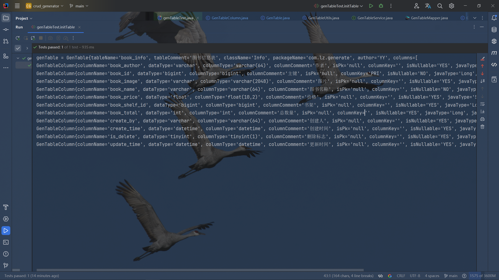

得到我们所需要生成的基本信息，之后根据这些信息可以生成我们的模版，给我们的模版填坑。


### 四、编写模版

#### 1、编写实体类（domain）模版

编写模版，无非就是填坑，在填坑的时候我们可以直接使用一个现成的实体类，然后再一步一步的填坑。

比如使用这个GenTable类来帮助我们填坑：

```java
package com.lz.crud_generator.model;

import java.util.List;

/**
 * @Author: YY
 * @Description: GenTable
 * @Version: 1.0
 */
public class GenTable {
    public String tableName;              // 表名
    public String tableComment;           // 表注释
    private String className;             // 实体类名称(首字母大写)
    private String packageName;           // 生成包路径
    private String author;                // 作者
    private String isPk;                  // 主键
    private List<GenTableColumn> columns; // 列表信息
    private static final long serialVersionUID = 1L;

    public String getTableName() {
        return tableName;
    }

    public void setTableName(String tableName) {
        this.tableName = tableName;
    }

    public String getTableComment() {
        return tableComment;
    }

    public void setTableComment(String tableComment) {
        this.tableComment = tableComment;
    }

    public String getClassName() {
        return className;
    }

    public void setClassName(String className) {
        this.className = className;
    }

    public String getPackageName() {
        return packageName;
    }

    public void setPackageName(String packageName) {
        this.packageName = packageName;
    }

    public String getAuthor() {
        return author;
    }

    public void setAuthor(String author) {
        this.author = author;
    }

    public List<GenTableColumn> getColumns() {
        return columns;
    }

    public void setColumns(List<GenTableColumn> columns) {
        this.columns = columns;
    }

    public String getIsPk() {
        return isPk;
    }

    public void setIsPk(String isPk) {
        this.isPk = isPk;
    }

    @Override
    public String toString() {
        return "GenTable{" +
                "tableName='" + tableName + '\'' +
                ", tableComment='" + tableComment + '\'' +
                ", className='" + className + '\'' +
                ", packageName='" + packageName + '\'' +
                ", author='" + author + '\'' +
                ", isPk='" + isPk + '\'' +
                ", columns=" + columns +
                '}';
    }
}

```

根据这个实体类，可以给他分为：

> 包路径（packageName）：实体类的路径
>
> 类名（className）：实体类名称
>
> 类注释：类的作者、类的一些注释信息，可以直接使用表注释、表名、作者
>
> 字段（javaField）：字段信息，字段的注释，字段的类型
>
> 其他：get、set、toString方法

现在，就给他逐步挖坑、填坑

#### 2、编写测试类加载模版

这里直接使用之前写的基础模版复制过来改一些就行：

```java
    @Test
    void generateDomain() throws IOException {
        //设置velocity资源加载器
        Properties prop = new Properties();
        prop.put("file.resource.loader.class", "org.apache.velocity.runtime.resource.loader.ClasspathResourceLoader");
        Velocity.init(prop);

        //创建Velocity容器
        VelocityContext context = new VelocityContext();
        GenTable genTable = genTableService.initTableInfo("book_info");
        String tableName = genTable.getTableName();
        String tableComment = genTable.getTableComment();
        String className = genTable.getClassName();
        String packageName = genTable.getPackageName();
        String author = genTable.getAuthor();
        List<GenTableColumn> columns = genTable.getColumns();
        String isPk = genTable.getIsPk();
        context.put("tableName",tableName);
        context.put("tableComment",tableComment);
        context.put("className",className);
        context.put("packageName",packageName);
        context.put("author",author);
        context.put("columns",columns);
        context.put("isPk",isPk);

        //加载模板
        Template tpl = Velocity.getTemplate("vms/java/domain.java.vm", "UTF-8");

        //文件输出位置
        String projectPath = System.getProperty("user.dir");
        String outputPath = projectPath + File.separator + "src" + File.separator + "main" + File.separator + "resources" + File.separator + "generated" + File.separator + "domain.java";
        // 创建文件对象
        File outputFile = new File(outputPath);

        // 创建目录
        File parentDir = outputFile.getParentFile();
        if (!parentDir.exists()) {
            parentDir.mkdirs();
        }

        // 创建文件写入器
        FileWriter fw = new FileWriter(outputFile);
        //合并数据到模板
        tpl.merge(context, fw);
        //释放资源
        fw.close();
    }
```

#### 3、编写模版

现更改一下类名、注释这些看是否能填入模版：

```java
package ${packageName};

import java.util.List;

/**
 * @Author: ${author}
 * @Description:
 * ${className}
 * ${tableComment}
 * 表：${tableName}
 * @Version: 1.0
 */
public class ${className} {
```

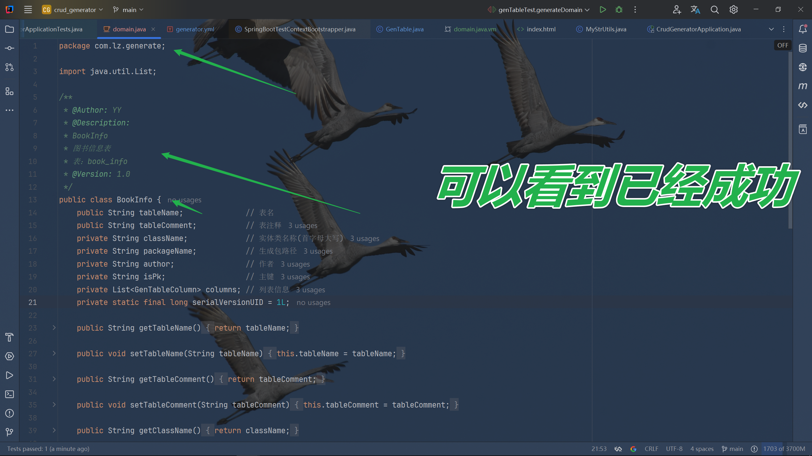

字段信息：

```java
    #foreach($column in $columns)
        #if($column.columnComment)
    /**
     * ${column.columnComment}
     */
    #end
    private ${column.javaType} ${column.javaField};
    #end
```

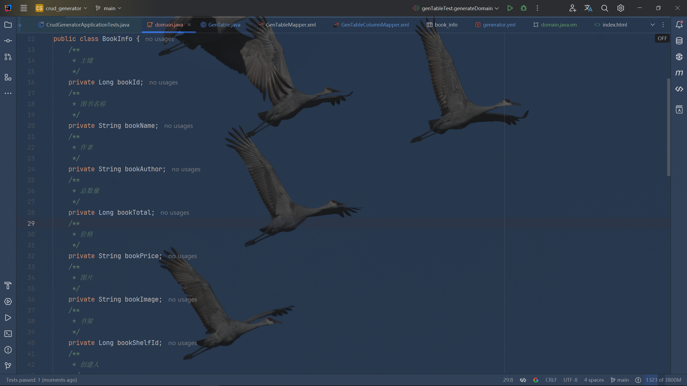

get、set、toString：

```java
    #foreach($column in $columns)
    #set($AttrName=$column.javaField.substring(0,1).toUpperCase() + ${column.javaField.substring(1)})
    public ${column.javaType} get${AttrName}() {
        return ${column.javaField};
    }

    public void set${AttrName}(${column.javaType} ${column.javaField}) {
        this.${column.javaField} = ${column.javaField};
    }
    #end

    @Override
    public String toString() {
        return "${className}{" +
        #foreach($column in $columns)
                "${column.javaField}='" + ${column.javaField} + '\n\'' +
        #end
                '}';
    }
```

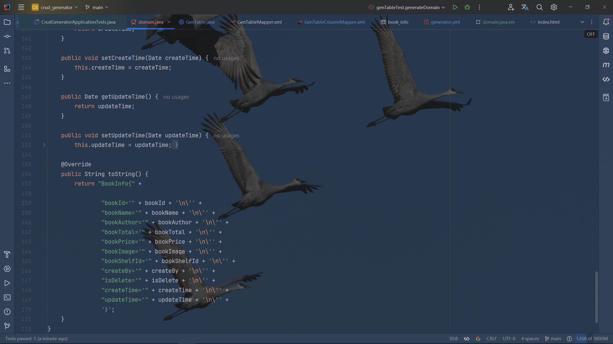

#### 4.更改文件输出位置：

```java
        //文件输出位置
        String projectPath = System.getProperty("user.dir");
        String[] packagePaths = MyStrUtils.split(packageName,".");
        System.out.println(packageName);
        StringBuilder packagePath = new StringBuilder();
        for (String s : packagePaths) {
            System.out.println(s);
            packagePath.append(s).append(File.separator);
        }
        String outputPath = projectPath + File.separator + "src" + File.separator + "main" + File.separator + "resources" + File.separator + "generated" + File.separator + packagePath + className+".java";
```

#### 5.抽取成工具类

1. 创建工具类**VelocityUtils**：

   ```java
       /**
        * 项目空间路径
        */
       private static final String PROJECT_PATH = "main/java";
   
       /**
        * mybatis空间路径
        */
       private static final String MYBATIS_PATH = "main/resources/mapper";
   
       /**
        * 模板
        */
       private static final String[] TEMPLATE_TYPE={
               "vms/java/domain.java.vm",
               "vms/java/mapper.java.vm",
               "vms/java/service.java.vm",
               "vms/java/serviceImpl.java.vm",
               "vms/xml/mapper.xml.vm",
       };
   ```

2. 初始化vm方法：

   ```java
       /**
        * 初始化vm方法
        */
       public static void initVelocity() {
           Properties p = new Properties();
           try {
               // 加载classpath目录下的vm文件
               p.setProperty("resource.loader.file.class", "org.apache.velocity.runtime.resource.loader.ClasspathResourceLoader");
               // 定义字符集
               p.setProperty(Velocity.INPUT_ENCODING, "UTF-8");
               // 初始化Velocity引擎，指定配置Properties
               Velocity.init(p);
           } catch (Exception e) {
               throw new RuntimeException(e);
           }
       }
   ```

3. 加载模版：

   ```java
       /**
        * 加载模板
        *
        * @param path 加载模版路径
        * @return 模版
        */
       public static Template loadTemplate(String path) {
           return Velocity.getTemplate(path, "UTF-8");
       }
   ```

4. 设置模版变量信息：

   ```java
   /**
        * 设置模板变量信息
        * @param genTable 表信息
        * @return 模板列表
        */
       public static VelocityContext prepareContext(GenTable genTable) {
           //创建Velocity容器
           VelocityContext context = new VelocityContext();
           String tableName = genTable.getTableName();
           String tableComment = genTable.getTableComment();
           String className = genTable.getClassName();
           String packageName = genTable.getPackageName();
           String author = genTable.getAuthor();
           List<GenTableColumn> columns = genTable.getColumns();
           String isPk = genTable.getIsPk();
           context.put("tableName", tableName);
           context.put("tableComment", tableComment);
           context.put("className", className);
           context.put("packageName", packageName);
           context.put("author", author);
           context.put("columns", columns);
           context.put("isPk", isPk);
           return context;
       }
   ```

5. 获取文件输出路径：

   ```java
       /**
        * 获取文件名
        */
       public static String getFileName(String templateType, GenTable genTable) {
           // 文件名称
           String fileName = "";
           // 包路径
           String packageName = genTable.getPackageName();
   
           // 大写类名
           String className = genTable.getClassName();
   
           String javaPath = PROJECT_PATH + "/" + MyStrUtils.replace(packageName, ".", "/");
           String mybatisPath = MYBATIS_PATH + "/";
   
           if (templateType.contains("domain.java.vm")) {
               fileName = MyStrUtils.format("{}/domain/{}.java", javaPath, className);
           } else if (templateType.contains("mapper.java.vm")) {
               fileName = MyStrUtils.format("{}/mapper/{}Mapper.java", javaPath, className);
           } else if (templateType.contains("service.java.vm")) {
               fileName = MyStrUtils.format("{}/service/I{}Service.java", javaPath, className);
           } else if (templateType.contains("serviceImpl.java.vm")) {
               fileName = MyStrUtils.format("{}/service/impl/{}ServiceImpl.java", javaPath, className);
           } else if (templateType.contains("controller.java.vm")) {
               fileName = MyStrUtils.format("{}/controller/{}Controller.java", javaPath, className);
           } else if (templateType.contains("mapper.xml.vm")) {
               fileName = MyStrUtils.format("{}/{}Mapper.xml", mybatisPath, className);
           }
           return System.getProperty("user.dir") + File.separator + "src" + File.separator + "main" + File.separator + "resources" + File.separator + "generated" + File.separator + fileName;
       }
   ```

6. 生成文件：

   ```java
       /**
        * 生成文件
        * @param templateTypePath 模板类型路径
        * @param genTable  生成表信息
        * @param template  模版
        * @param context   模版变量
        */
       public static void outputFile(String templateTypePath,GenTable genTable, Template template, VelocityContext context) {
           //获取文件输出路径
           String outputPath = getFileName(templateTypePath, genTable);
           // 创建文件对象
           File outputFile = new File(outputPath);
   
           // 创建目录
           File parentDir = outputFile.getParentFile();
           if (!parentDir.exists()) {
               parentDir.mkdirs();
           }
   
           // 创建文件写入器
           FileWriter fw = null;
           try {
               fw = new FileWriter(outputFile);
           } catch (IOException e) {
               throw new RuntimeException(e);
           }
           //合并数据到模板
           template.merge(context, fw);
           //释放资源
           try {
               fw.close();
           } catch (IOException e) {
               throw new RuntimeException(e);
           }
       }
   ```

7. 优化表生成信息

   因为之前我们没有设置主键的类型在生成表信息里面，所以需要加一个主键字段类型**GenTable**

   ```java
       private String isPkJavaType;          // 主键类型
       private String isPkJavaField;         // 主键java字段
   ```

   修改**GenTableUtils**

   ```java
       /**
        * @description: 初始化表信息
        * @param: genTable
        **/
       public static void initTableInfo(GenTable genTable, List<GenTableColumn> tableColumns) {
           for (GenTableColumn tableColumn : tableColumns) {
               //初始化Java类型
               initTableColumnJavaType(tableColumn);
               //初始化Java字段
               initTableColumnJavaField(tableColumn);
               //判断主键
               if (tableColumn.getColumnKey().equals(PRI)) {
                   genTable.setIsPk(tableColumn.getColumnName());
                   genTable.setIsPkJavaType(tableColumn.getJavaType());
                   genTable.setIsPkJavaField(tableColumn.getJavaField());
               }
           }
           genTable.setColumns(tableColumns);
       }
   ```

   修改**VelocityUtils**

   ```java
       /**
        * 设置模板变量信息
        *
        * @param genTable 表信息
        * @return 模板列表
        */
       public static VelocityContext prepareContext(GenTable genTable) {
           //创建Velocity容器
           VelocityContext context = new VelocityContext();
           String tableName = genTable.getTableName();
           String tableComment = genTable.getTableComment();
           String className = genTable.getClassName();
           String packageName = genTable.getPackageName();
           String author = genTable.getAuthor();
           List<GenTableColumn> columns = genTable.getColumns();
           String isPk = genTable.getIsPk();
           String isPkJavaType = genTable.getIsPkJavaType();
           String isPkJavaField = genTable.getIsPkJavaField();
           context.put("tableName", tableName);
           context.put("tableComment", tableComment);
           context.put("className", className);
           context.put("packageName", packageName);
           context.put("author", author);
           context.put("columns", columns);
           context.put("isPk", isPk);
           context.put("isPkJavaType", isPkJavaType);
           context.put("isPkJavaField", isPkJavaField);
           return context;
       }
   ```

   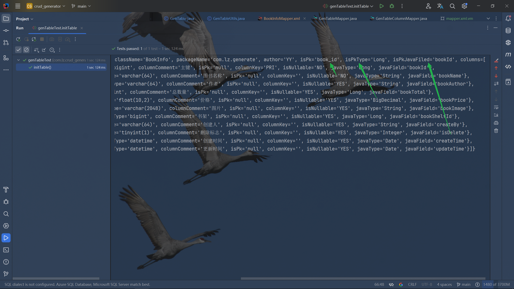

#### 6.模版

目录格式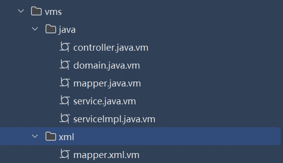

**mapper.xml.vm**

```xml
<?xml version="1.0" encoding="UTF-8" ?>
<!DOCTYPE mapper
PUBLIC "-//mybatis.org//DTD Mapper 3.0//EN"
"http://mybatis.org/dtd/mybatis-3-mapper.dtd">
<mapper namespace="${packageName}.mapper.${className}Mapper">
    
    <resultMap type="${className}" id="${className}Result">
#foreach ($column in $columns)
        <result property="${column.javaField}"    column="${column.columnName}"    />
#end
    </resultMap>

    <sql id="select${className}Vo">
        select#foreach($column in $columns) $column.columnName#if($foreach.count != $columns.size()),#end#end from ${tableName}
    </sql>

    <select id="select${className}List" parameterType="${className}" resultMap="${className}Result">
        <include refid="select${className}Vo"/>
        <where>
            #foreach($column in $columns)
            <if test="$column.javaField != null #if($column.javaType == 'String' ) and $column.javaField != ''#end">
                and $column.columnName = #{$column.javaField}
            </if>
            #end
        </where>
    </select>

    #set($isPkJavaFieldAttrName=${isPkJavaField.substring(0,1).toUpperCase()} + ${isPkJavaField.substring(1)})
    <select id="select${className}By${isPkJavaFieldAttrName}" parameterType="${isPkJavaType}" resultMap="${className}Result">
        <include refid="select${className}Vo"/>
        where ${isPk} = #{${isPkJavaField}}
    </select>
        
    <insert id="insert${className}" parameterType="${className}">
        insert into ${tableName}
        <trim prefix="(" suffix=")" suffixOverrides=",">
#foreach($column in $columns)
            <if test="$column.javaField != null#if($column.javaType == 'String' ) and $column.javaField != ''#end">$column.columnName,</if>
#end
         </trim>
        <trim prefix="values (" suffix=")" suffixOverrides=",">
#foreach($column in $columns)
            <if test="$column.javaField != null#if($column.javaType == 'String' ) and $column.javaField != ''#end">#{$column.javaField},</if>
#end
         </trim>
    </insert>

    <update id="update${className}" parameterType="${className}">
        update ${tableName}
        <trim prefix="SET" suffixOverrides=",">
#foreach($column in $columns)
            <if test="$column.javaField != null#if($column.javaType == 'String') and $column.javaField != ''#end">$column.columnName = #{$column.javaField},</if>
#end
        </trim>
        where ${isPk} = #{${isPkJavaField}}
    </update>

    <delete id="delete${className}By${isPkJavaFieldAttrName}" parameterType="${isPkJavaType}">
        delete from ${tableName} where ${isPk} = #{${isPkJavaField}}
    </delete>

    <delete id="delete${className}By${isPkJavaFieldAttrName}s" parameterType="String">
        delete from ${tableName} where ${isPk} in
        <foreach item="${isPkJavaField}Item" collection="array" open="(" separator="," close=")">
            ${isPkJavaField}Item
        </foreach>
    </delete>

</mapper>
```

**mapper.java.vm**

```java
package ${packageName}.mapper;

import java.util.List;
import ${packageName}.model.domain.${className};

import org.apache.ibatis.annotations.Mapper;
/**
 * ${tableComment}Mapper接口
 * 
 * @author ${author}
 */
@Mapper
public interface ${className}Mapper
{
    /**
     * 查询${tableComment}
     * 
     * @param ${isPkJavaField} ${tableComment}主键
     * @return ${tableComment}
     */
    #set($isPkJavaFieldAttrName=${isPkJavaField.substring(0,1).toUpperCase()} + ${isPkJavaField.substring(1)})
    public ${className} select${className}By${isPkJavaFieldAttrName}(${isPkJavaType} ${isPkJavaField});

    #set($classNameLower=${className.substring(0,1).toLowerCase()} + ${className.substring(1)})
    /**
     * 查询${tableComment}列表
     *
     * @param ${classNameLower} ${tableComment}
     * @return ${tableComment}集合
     */
    public List<${className}> select${className}List(${className} ${classNameLower});

    /**
     * 新增${tableComment}
     * 
     * @param ${classNameLower} ${tableComment}
     * @return int
     */
    public int insert${className}(${className} ${classNameLower});

    /**
     * 修改${tableComment}
     * 
     * @param ${classNameLower} ${tableComment}
     * @return int
     */
    public int update${className}(${className} ${classNameLower});

    /**
     * 删除${tableComment}
     * 
     * @param ${isPkJavaField} ${tableComment}主键
     * @return int
     */
    public int delete${className}By${isPkJavaFieldAttrName}(${isPkJavaType} ${isPkJavaField});

    /**
     * 批量删除${tableComment}
     * 
     * @param ${isPkJavaField}s 需要删除的数据主键集合
     * @return int
     */
    public int delete${className}By${isPkJavaFieldAttrName}s(${isPkJavaType}[] ${isPkJavaField}s);
}

```

**serviceImpl.java.vm**

```java
package ${packageName}.service.impl;

import java.util.List;
#foreach ($column in $columns)
#if($column.javaField == 'createTime' || $column.javaField == 'updateTime')
import java.util.Date;
#break
#end
#end
import org.springframework.beans.factory.annotation.Autowired;
import org.springframework.stereotype.Service;

import ${packageName}.mapper.${className}Mapper;
import ${packageName}.model.domain.${className};

import javax.xml.crypto.Data;
import {packageName}.service.I${className}Service;

/**
 * ${tableComment}Service业务层处理
 * 
 * @author ${author}
 */
@Service
public class ${className}ServiceImpl implements I${className}Service
{
    #set($classNameLower=${className.substring(0,1).toLowerCase()} + ${className.substring(1)})
    @Autowired
    private ${className}Mapper ${classNameLower}Mapper;

    /**
     * 查询${tableComment}
     *
     * @param ${isPkJavaField} ${tableComment}主键
     * @return ${className}
     */
        #set($isPkJavaFieldAttrName=${isPkJavaField.substring(0,1).toUpperCase()} + ${isPkJavaField.substring(1)})
    @Override
    public ${className} select${className}By${isPkJavaFieldAttrName}(${isPkJavaType} ${isPkJavaField})
    {
        return ${classNameLower}Mapper.select${className}By${isPkJavaFieldAttrName}(${isPkJavaField});
    }
    /**
     * 查询${tableComment}列表
     * 
     * @param ${classNameLower} ${tableComment}
     * @return List<${className}>
     */
    @Override
    public List<${className}> select${className}List(${className} ${classNameLower})
    {
        return ${classNameLower}Mapper.select${className}List(${classNameLower});
    }

    /**
     * 新增${tableComment}
     * 
     * @param ${classNameLower} ${tableComment}
     * @return 结果
     */
    @Override
    public int insert${className}(${className} ${classNameLower})
    {
#foreach ($column in $columns)
#if($column.javaField == 'createTime')
        ${classNameLower}.setCreateTime(new Date());
#end
#end
        return ${classNameLower}Mapper.insert${className}(${classNameLower});
    }

    /**
     * 修改${tableComment}
     * 
     * @param ${classNameLower} ${tableComment}
     * @return int
     */
    @Override
    public int update${className}(${className} ${classNameLower})
    {
#foreach ($column in $columns)
#if($column.javaField == 'updateTime')
        ${classNameLower}.setUpdateTime(new Date());
#end
#end
        return ${classNameLower}Mapper.update${className}(${classNameLower});
    }

    /**
     * 批量删除${tableComment}
     * 
     * @param ${isPkJavaField}s 需要删除的${tableComment}主键
     * @return int
     */
    @Override
    public int delete${className}By${isPkJavaFieldAttrName}s(${isPkJavaType}[] ${isPkJavaField}s)
    {
        return ${classNameLower}Mapper.delete${className}By${isPkJavaFieldAttrName}s(${isPkJavaField}s);
    }

    /**
     * 删除${tableComment}信息
     * 
     * @param ${isPkJavaField} ${tableComment}主键
     * @return int
     */
    @Override
    public int delete${className}By${isPkJavaFieldAttrName}(${isPkJavaType} ${isPkJavaField}){
        return ${classNameLower}Mapper.delete${className}By${isPkJavaFieldAttrName}(${isPkJavaField});
    }
}

```

**service.java.vm**

```java
package ${packageName}.service;

import java.util.List;
import ${packageName}.model.domain.${className};

/**
 * ${tableComment}Service接口
 * 
 * @author ${author}
 */
public interface I${className}Service
{
    /**
     * 查询${tableComment}
     * 
     * @param ${isPkJavaField} ${tableComment}主键
     * @return ${className}
     */
    #set($isPkJavaFieldAttrName=${isPkJavaField.substring(0,1).toUpperCase()} + ${isPkJavaField.substring(1)})
    public ${className} select${className}By${isPkJavaFieldAttrName}(${isPkJavaType} ${isPkJavaField});

    #set($classNameLower=${className.substring(0,1).toLowerCase()} + ${className.substring(1)})
    /**
     * 查询${tableComment}列表
     *
     * @param ${classNameLower} ${tableComment}
     * @return ${tableComment}集合
     */
    public List<${className}> select${className}List(${className} ${classNameLower});

    /**
     * 新增${tableComment}
     * 
     * @param ${classNameLower} ${tableComment}
     * @return int
     */
    public int insert${className}(${className} ${classNameLower});

    /**
     * 修改${tableComment}
     * 
     * @param ${classNameLower} ${tableComment}
     * @return int
     */
    public int update${className}(${className} ${classNameLower});

    /**
     * 批量删除${tableComment}
     * 
     * @param ${isPkJavaField}s 需要删除的${tableComment}主键集合
     * @return int
     */
    public int delete${className}By${isPkJavaFieldAttrName}s(${isPkJavaType}[] ${isPkJavaField}s);

    /**
     * 删除${tableComment}信息
     * 
     * @param ${isPkJavaField} ${tableComment}主键
     * @return int
     */
    public int delete${className}By${isPkJavaFieldAttrName}(${isPkJavaType} ${isPkJavaField});
}

```

**controler.java.vm**

```java
package ${packageName}.controller;

import java.util.List;
import javax.servlet.http.HttpServletResponse;
import org.springframework.beans.factory.annotation.Autowired;
import org.springframework.web.bind.annotation.GetMapping;
import org.springframework.web.bind.annotation.PostMapping;
import org.springframework.web.bind.annotation.PutMapping;
import org.springframework.web.bind.annotation.DeleteMapping;
import org.springframework.web.bind.annotation.PathVariable;
import org.springframework.web.bind.annotation.RequestBody;
import org.springframework.web.bind.annotation.RequestMapping;
import org.springframework.web.bind.annotation.RestController;
import ${packageName}.model.domain.${className};
import ${packageName}.service.I${className}Service;

/**
 * ${tableComment}Controller
 * 
 * @author ${author}
 */
@RestController
@RequestMapping("/${tableName}")
public class ${className}Controller
{
    #set($classNameLower=${className.substring(0,1).toLowerCase()} + ${className.substring(1)})
    @Autowired
    private I${className}Service ${classNameLower}Service;

    /**
     * 查询${tableComment}列表
     */
    @GetMapping("/list")
    public List<${className}> list(${className} ${classNameLower})
    {
        return ${classNameLower}Service.select${className}List(${classNameLower});
    }


    /**
     * 获取${tableComment}详细信息
     */
     #set($isPkJavaFieldAttrName=${isPkJavaField.substring(0,1).toUpperCase()} + ${isPkJavaField.substring(1)})
    @GetMapping(value = "/{${isPkJavaField}}")
    public ${className} getInfo(@PathVariable("${isPkJavaField}") ${isPkJavaType} ${isPkJavaField})
    {
        return ${classNameLower}Service.select${className}By${isPkJavaFieldAttrName}(${isPkJavaField});
    }

    /**
     * 新增${tableComment}
     */
    @PostMapping
    public int add(@RequestBody ${className} ${classNameLower})
    {
        return ${classNameLower}Service.insert${className}(${classNameLower});
    }

    /**
     * 修改${tableComment}
     */
    @PutMapping
    public int edit(@RequestBody ${className} ${classNameLower})
    {
        return ${classNameLower}Service.update${className}(${classNameLower});
    }

    /**
     * 删除${tableComment}
     */
	@DeleteMapping("/{${isPkJavaField}s}")
    public int remove(@PathVariable ${isPkJavaType}[] ${isPkJavaField}s)
    {
        return ${classNameLower}Service.delete${className}By${isPkJavaFieldAttrName}s(${isPkJavaField}s);
    }
}

```

#### 7.测试

**新增**：post请求：

```js
localhost:8080/book_info
```

```json
{
    "bookName": "活着",
    "bookAuthor": "余华",
    "bookTotal": 10,
    "bookPrice": 10.1,
    "bookImage": null,
    "bookShelfId": 1,
    "createBy": "YY",
    "isDelete": 0,
    "createTime": "2024-10-12T03:06:41.000+00:00",
    "updateTime": "2024-10-12T03:06:43.000+00:00"
}
```

**修改**：put请求：

```js
localhost:8080/book_info
```

```json
{
    "bookId":2,	//实际id
    "bookName": "活着",
    "bookAuthor": "余华",
    "bookTotal": 1011,
    "bookPrice": 10.1,
    "bookImage": null,
    "bookShelfId": 1,
    "createBy": "YY",
    "isDelete": 0,
    "createTime": "2024-10-12T03:06:41.000+00:00",
    "updateTime": "2024-10-12T03:06:43.000+00:00"
}
```

**详细信息**：get请求：

```js
localhost:8080/book_info/1
```

**列表**：get请求：

```
localhost:8080/book_info/list?bookName=活着
```

**删除**：delete请求：

自行测试。

### 五、完善项目

#### 1.controller统一返回

​		日常`JAVA Web`项目开发过程中，一般都是基于`HTTP+REST`风格，`Controller`接口返回`JSON`格式数据到前端，前端获取`JSON`后展示在前端，为了项目的返回数据格式统一，所以需要统一返回数据工具类封装。而这些东西也不要自己背下来，能看懂就行了，网上也有很多，所以直接使用提供的这个就行：

```java
import java.io.Serializable;

/**
 * REST接口统一返回数据工具类封装RestResponse
 *
 * @param <T>
 */
public class RestResponse<T> implements Serializable {

    private static final long serialVersionUID = 3728877563912075885L;

    private int code;
    private String msg;
    private T data;

    public RestResponse() {

    }

    public RestResponse(int code, String message, T data) {
        this.code = code;
        this.setMsg(message);
        this.data = data;
    }

    public RestResponse(int code, T data) {
        this.code = code;
        this.data = data;
    }

    public RestResponse(int code, String message) {
        this.code = code;
        this.setMsg(message);
    }

    /**
     * 成功时-返回data
     *
     * @param <T>
     * @return
     */
    public static <T> RestResponse<T> success(T data) {
        return new RestResponse<T>(200, null, data);
    }

    /**
     * 成功-不返回data
     *
     * @param <T>
     * @return
     */
    public static <T> RestResponse<T> success(String msg) {
        return new RestResponse<T>(200, msg);
    }

    /**
     * 成功-返回data+msg
     *
     * @param <T>
     * @return
     */
    public static <T> RestResponse<T> success(String msg, T data) {
        return new RestResponse<T>(200, msg, data);
    }

    /**
     * 失败
     *
     * @param <T>
     * @return
     */
    public static <T> RestResponse<T> fail(String msg) {
        return new RestResponse<T>(500, msg, null);
    }

    /**
     * 失败-code
     *
     * @param <T>
     * @return
     */
    public static <T> RestResponse<T> fail(int code, String msg) {
        return new RestResponse<T>(code, msg, null);
    }


    public int getCode() {
        return code;
    }

    public String getMsg() {
        return msg;
    }


    public T getData() {
        return data;
    }

    public void setCode(int code) {
        this.code = code;
    }

    public void setMsg(String msg) {
        this.msg = msg;
    }

    public void setData(T data) {
        this.data = data;
    }

    @Override
    public String toString() {
        return "RestResponse{" + "code=" + code + ", msg='" + msg + '\'' + ", data=" + data + '}';
    }
}

```

修改完成后，重新修改controller.java.vm的模版

```java
package ${packageName}.controller;

import com.lz.crud_generator.common.RestResponse;
import javax.servlet.http.HttpServletResponse;
import org.springframework.beans.factory.annotation.Autowired;
import org.springframework.web.bind.annotation.GetMapping;
import org.springframework.web.bind.annotation.PostMapping;
import org.springframework.web.bind.annotation.PutMapping;
import org.springframework.web.bind.annotation.DeleteMapping;
import org.springframework.web.bind.annotation.PathVariable;
import org.springframework.web.bind.annotation.RequestBody;
import org.springframework.web.bind.annotation.RequestMapping;
import org.springframework.web.bind.annotation.RestController;
import ${packageName}.model.domain.${className};
import ${packageName}.service.I${className}Service;

/**
 * ${tableComment}Controller
 * 
 * @author ${author}
 */
@RestController
@RequestMapping("/${tableName}")
public class ${className}Controller
{
    #set($classNameLower=${className.substring(0,1).toLowerCase()} + ${className.substring(1)})
    @Autowired
    private I${className}Service ${classNameLower}Service;

    /**
     * 查询${tableComment}列表
     */
    @GetMapping("/list")
    public RestResponse list(${className} ${classNameLower})
    {
        return RestResponse.success(${classNameLower}Service.select${className}List(${classNameLower}));
    }


    /**
     * 获取${tableComment}详细信息
     */
     #set($isPkJavaFieldAttrName=${isPkJavaField.substring(0,1).toUpperCase()} + ${isPkJavaField.substring(1)})
    @GetMapping(value = "/{${isPkJavaField}}")
    public RestResponse getInfo(@PathVariable("${isPkJavaField}") ${isPkJavaType} ${isPkJavaField})
    {
        return RestResponse.success(${classNameLower}Service.select${className}By${isPkJavaFieldAttrName}(${isPkJavaField}));
    }

    /**
     * 新增${tableComment}
     */
    @PostMapping
    public RestResponse add(@RequestBody ${className} ${classNameLower})
    {
        return RestResponse.success("新增成功",${classNameLower}Service.insert${className}(${classNameLower}));
    }

    /**
     * 修改${tableComment}
     */
    @PutMapping
    public RestResponse edit(@RequestBody ${className} ${classNameLower})
    {
        return RestResponse.success("修改成功",${classNameLower}Service.update${className}(${classNameLower}));
    }

    /**
     * 删除${tableComment}
     */
	@DeleteMapping("/{${isPkJavaField}s}")
    public RestResponse remove(@PathVariable ${isPkJavaType}[] ${isPkJavaField}s)
    {
        return RestResponse.success("删除成功",${classNameLower}Service.delete${className}By${isPkJavaFieldAttrName}s(${isPkJavaField}s));
    }
}

```

主要修改了返回值，返回类型。

**测试**：

**新增**：post请求：

```js
localhost:8080/book_info
```

```json
{
    "bookName": "第七天",
    "bookAuthor": "余华",
    "bookTotal": 100,
    "bookPrice": 29.1,
    "bookImage": null,
    "bookShelfId": 1,
    "createBy": "荔枝",
    "isDelete": 0,
    "createTime": "2024-10-12T03:06:41.000+00:00",
    "updateTime": "2024-10-12T03:06:43.000+00:00"
}
```

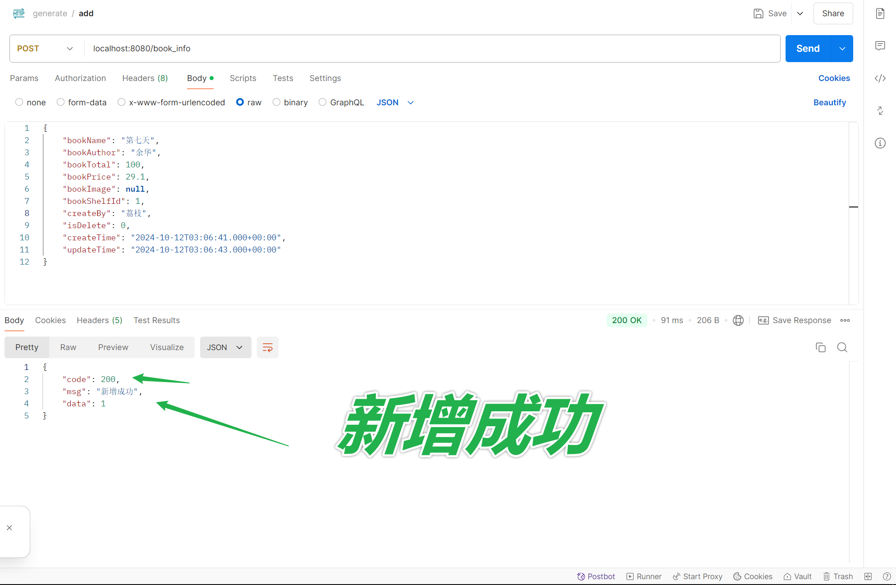

**修改**：put请求：

```js
localhost:8080/book_info
```

```json
{
    "bookId":2,
    "bookName": "活着",
    "bookAuthor": "余华",
    "bookTotal": 100,
    "bookPrice": 30,
    "bookImage": null,
    "bookShelfId": 1,
    "createBy": "YY",
    "isDelete": 0,
    "createTime": "2024-10-12T03:06:41.000+00:00",
    "updateTime": "2024-10-12T03:06:43.000+00:00"
}
```

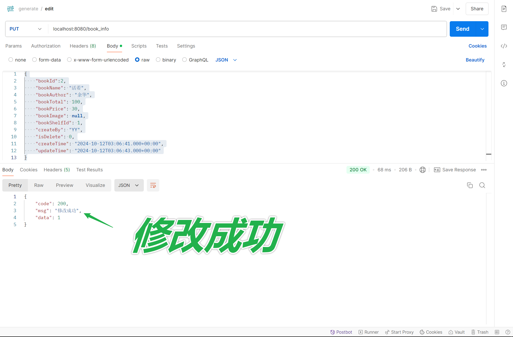

**详细信息**：get请求：

```js
localhost:8080/book_info/1
```

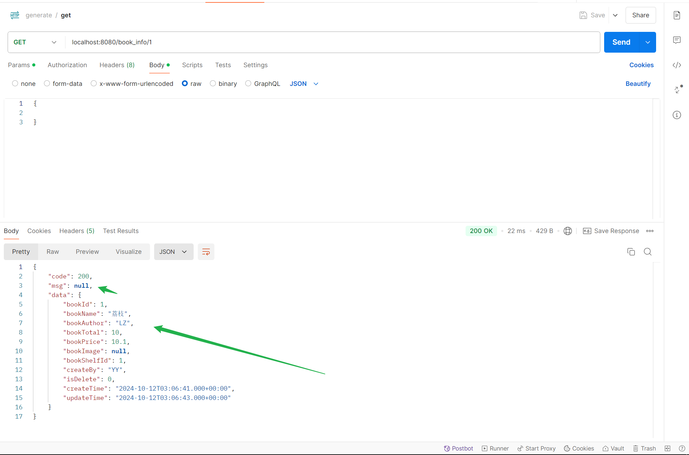

**列表**：get请求：

```
localhost:8080/book_info/list?bookName=活着
```

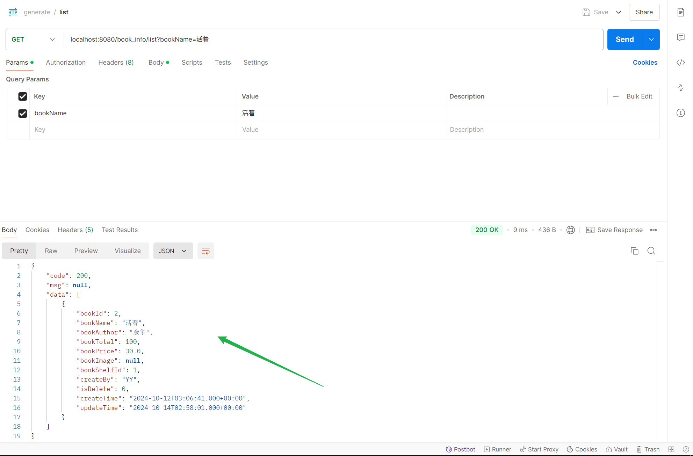

**删除**：delete请求：

自行测试。


#### 2.新增swagger测试接口

1. 添加依赖：

   ```xml
           <dependency>
               <groupId>com.github.xiaoymin</groupId>
               <artifactId>knife4j-spring-boot-starter</artifactId>
               <version>3.0.3</version>
           </dependency>
   ```

2. 编写config：

   ```java
   port com.fasterxml.classmate.TypeResolver;
   import com.github.xiaoymin.knife4j.spring.annotations.EnableKnife4j;
   import io.swagger.annotations.ApiOperation;
   import org.springframework.beans.factory.annotation.Autowired;
   import org.springframework.context.annotation.Bean;
   import org.springframework.context.annotation.Configuration;
   import org.springframework.core.env.Environment;
   import org.springframework.core.env.Profiles;
   import springfox.documentation.builders.ApiInfoBuilder;
   import springfox.documentation.builders.PathSelectors;
   import springfox.documentation.builders.RequestHandlerSelectors;
   import springfox.documentation.service.ApiInfo;
   import springfox.documentation.service.Contact;
   import springfox.documentation.spi.DocumentationType;
   import springfox.documentation.spring.web.plugins.Docket;
   import springfox.documentation.swagger2.annotations.EnableSwagger2;
   
   /**
    * 作用: 自动生成API文档和在线接口调试工具
    */
   
   @Configuration
   //该注解是Springfox-swagger框架提供的使用Swagger注解，该注解必须加
   @EnableSwagger2
   //knife4j提供的增强扫描注解,Ui提供了例如动态参数、参数过滤、接口排序等增强功能
   @EnableKnife4j
   public class Knife4jConfig {
   
       /**
        *     创建一个Docket的对象，相当于是swagger的一个实例 ： 配置开发和测试环境下开启Swagger，生产发布时关闭
        *
        *     RequestHandlerSelectors,配置要扫描接口的方式
        *     basePackage：指定扫描的包路径
        *     any：扫描全部
        *     none：全部不扫描
        *     withClassAnnotation:扫描类上的注解，如RestController
        *     withMethodAnnotation:扫描方法上的注解，如GetMapping
        *
        * @return
        */
       @Autowired
       TypeResolver typeResolver;
       @Bean
       public Docket createRestApi(Environment environment)
       {
           //设置显示的swagger环境信息,判断是否处在自己设定的环境当中,为了安全生产环境不开放Swagger
           Profiles profiles=Profiles.of("dev","test");
           boolean flag=environment.acceptsProfiles(profiles);
           //创建一个Docket的对象，相当于是swagger的一个实例
           return new Docket(DocumentationType.SWAGGER_2)
                   .useDefaultResponseMessages(false)
                   .groupName("1.x版本")
                   .apiInfo(apiInfo())
                   //只有当springboot配置文件为dev或test环境时，才开启swaggerAPI文档功能
                   .enable(flag)
                   .select()
                   // 这里指定Controller扫描包路径:设置要扫描的接口类，一般是Controller类
                   .apis(RequestHandlerSelectors.basePackage("com.lz.crud_generator.generate.controller"))  //这里采用包扫描的方式来确定要显示的接口
                   .apis(RequestHandlerSelectors.withMethodAnnotation(ApiOperation.class)) //这里采用包含注解的方式来确定要显示的接口
                   // 配置过滤哪些，设置对应的路径才获取
                   .paths(PathSelectors.any())
                   .build();
       }
   
       ///配置相关的api信息
       private ApiInfo apiInfo()
       {
           return new ApiInfoBuilder()
                   .description("API调试文档")
                   //作者信息
                   .contact(new Contact("荔枝", "http://localhost:8080/doc.html", "321@qq.com"))
                   .version("v1.0")
                   .title("API文档")
                   //服务Url
                   .termsOfServiceUrl("http://localhost:8080")
                   .build();
       }
   ```

3. 开启支持swagger：

   在这里我们把配置文件分开了，

   当前文件为：**application.yml**:

   ```
   # 开发环境配置
   server:
     # 服务器的HTTP端口，默认为8080
     port: 8080
   spring:
     # 默认 test 环境
     profiles:
       active: test
     # 支持 swagger3
     mvc:
       pathmatch:
         matching-strategy: ant_path_matcher
   ```

   **application-test.yml**:

   ```
   # 数据源配置
   spring:
     datasource:
       type: com.alibaba.druid.pool.DruidDataSource
       driverClassName: com.mysql.cj.jdbc.Driver
       url: jdbc:mysql://localhost:3306/syy_lz_generator?useUnicode=true&characterEncoding=utf8&zeroDateTimeBehavior=convertToNull&useSSL=true&serverTimezone=GMT%2B8
       username: root
       password: yy0908..
   
   # MyBatis配置
   mybatis:
     # 搜索指定包别名
     typeAliasesPackage: com.lz.**.model
     # 配置mapper的扫描，找到所有的mapper.xml映射文件
     mapperLocations: classpath*:mapper/**/*Mapper.xml
     # 加载全局的配置文件
     configLocation: classpath:mybatis/mybatis-config.xml
   ```

   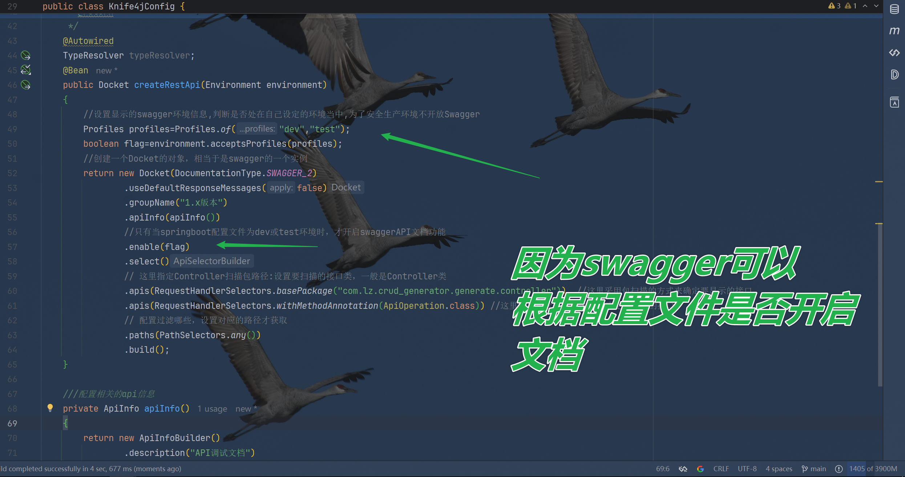

 4. 为需要的接口添加

    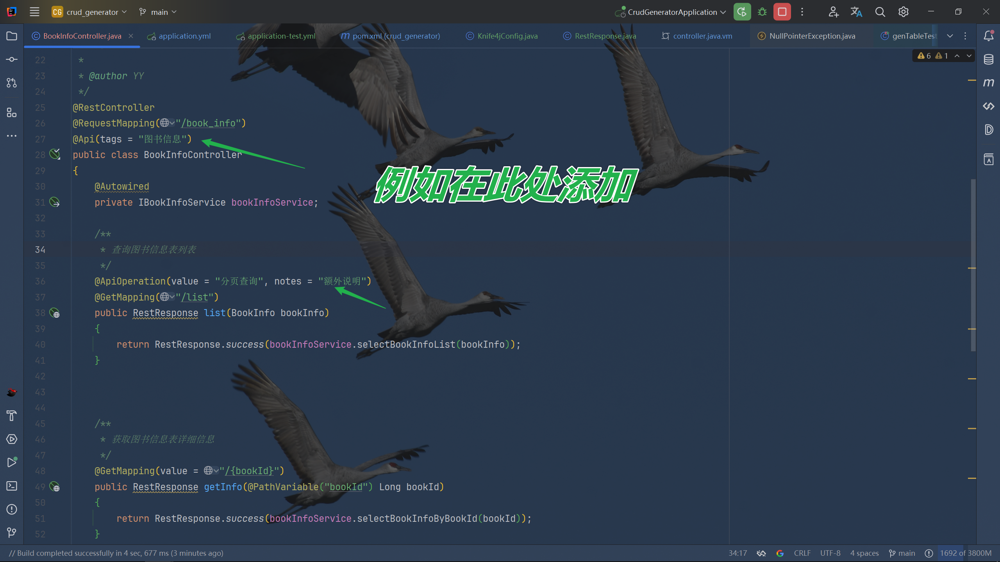

5. 测试

   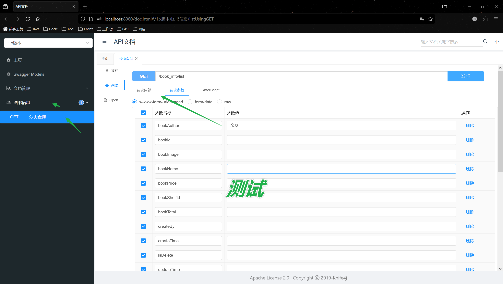
