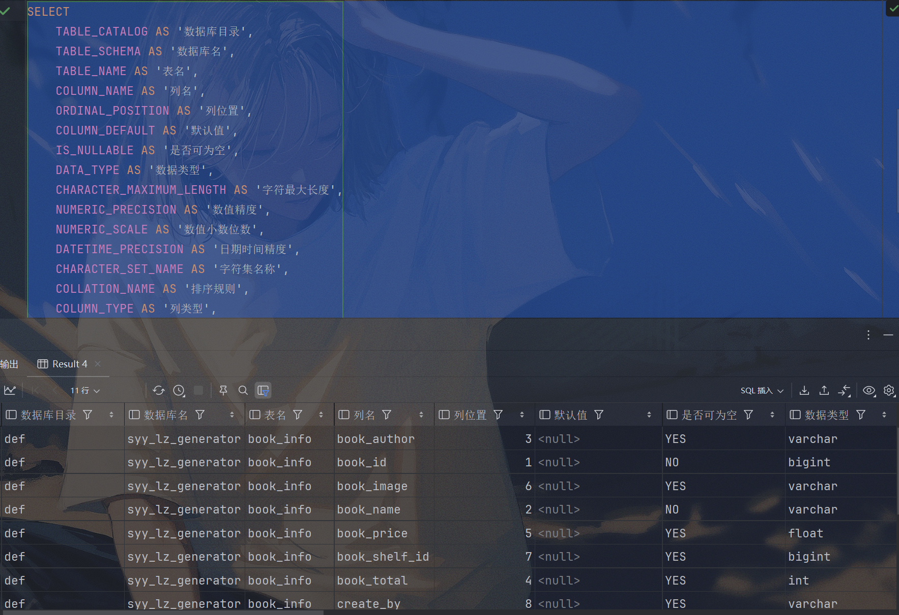
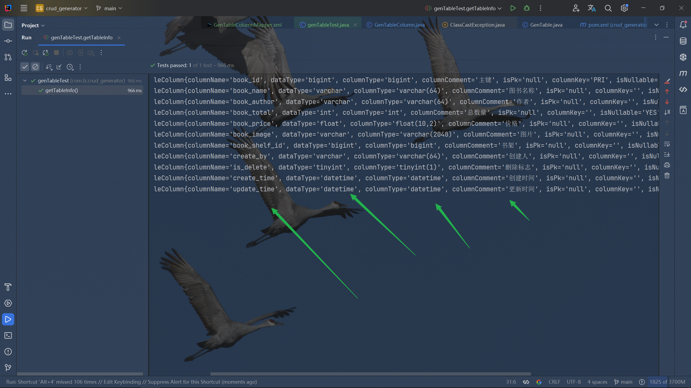

# ***荔枝代码生成器***

## 简介

​		本教程旨在为开发人员提供详细的代码指南，了解代码生成器，助你从零开始构建一个Java代码生成器。

​		本教程分为三个主要部分，每个部分都会介绍相关的工具和技术且每个部分循环递进，可以说是三个教程，让你一次性学三个教程！！！

#### 第一部分：Velocity模板引擎教程

​			代码生成的第一步是理解和使用模板引擎，而Velocity是广泛应用的Java模板引擎之一。在本部分中，我会详细介绍Velocity的基础知识，包括模板的语法、占位符、变量传递等。通过学习Velocity，让大家了解velocity的模板，能够自己独立生成一个基本的模版。

#### 第二部分：Java生成基本的增删改查（CRUD）代码

​		在掌握Velocity的基础上，第二部分教程将深入到如何通过Java代码实现基础的增删改查代码生成器。有了此代码生成器，大家能够快速的生成自己的项目，了解代码生成器，自己也可以定制专属于自己的代码生成器。

#### 第三部分：生成若依应用代码生成器

​		第三部分教程则是本课程的重点，即如何为若依App框架生成前端的uniapp代码。若依作为一个流行的开源Java开发框架，已经集成了许多常见的开发功能，其中包括代码生成器功能，但是若依APP并没有生成uniapp的模版，我们将一步一步了解若依的代码生成模块，并在此模块基础上，生成若依APP的代码生成器。

​		同时，我们工作室已经坐好若依APP的代码生成器，且已经在若依APP的推荐项目中展示（https://gitee.com/SpringSunYY/LZ-RuoYi-App）

​		

### 总结

​		通过本教程，你将逐步掌握Velocity模板引擎的使用技巧，学会如何通过Java代码生成基础的增删改查功能，并最终为若依APP构建代码生成器。教程中不仅涵盖了各步骤的理论知识，还包括了大量的实践操作和技巧，旨在帮助你提高开发效率，减少重复工作，成为更加高效的Java开发人员。


## 第一部分：Velocity模板引擎教程

### 一、常见的Java模板引擎

#### 1. **Velocity**

Velocity是一个轻量级的模板引擎，专为在Java项目中动态生成内容而设计。它被广泛用于生成HTML页面、XML文件、配置文件，尤其是在代码生成器领域。

**特点**：

- 语法简单，容易上手
- 高度可扩展，适合各种类型的模板生成需求
- 可与Java无缝集成，使用`VelocityContext`传递数据到模板中
- 性能较好，适合大型代码生成器的开发

**优点**：

- **广泛使用**：Velocity是成熟的技术，文档丰富，社区支持良好，在代码生成器领域应用广泛。
- **灵活性强**：其模板灵活性较强，可以适用于各种代码生成场景，比如生成Controller、Service、Mapper等层的代码。
- **与Java高度兼容**：Velocity与Java深度集成，通过简单的API即可将数据传递到模板中，从而生成Java代码。
- **学习曲线低**：相对简单的语法，使其更容易掌握，适合快速上手并应用在代码生成器中。

#### 2. **Freemarker**

Freemarker是另一个常用的Java模板引擎，专门设计用于生成文本（包括HTML、XML、Java代码等）。

**特点**：

- 强大的表达式语言，支持复杂的逻辑控制
- 比Velocity语法稍复杂，但功能更加丰富
- 有丰富的内置函数和控制指令

**优点**：

- **功能丰富**：Freemarker比Velocity提供更多的模板指令和内置函数，适合复杂模板的处理。
- **灵活的条件和循环控制**：Freemarker提供强大的控制结构（如条件语句和循环），可处理复杂的数据和逻辑。

**缺点**：

- **学习曲线较高**：相比Velocity，Freemarker的语法更加复杂，需要更多的时间去学习和理解。
- **性能稍逊**：在某些场景下，Freemarker的运行性能不如Velocity，特别是生成大量代码时。

#### 3. **Thymeleaf**

Thymeleaf主要用于生成动态HTML页面，适合Web应用中的视图层。

**特点**：

- 主要用于生成HTML、XML，不太适合Java代码生成
- 与Spring框架集成紧密，是Spring MVC的首选模板引擎

**优点**：

- **Web应用友好**：Thymeleaf在生成Web页面时非常高效，与前端代码结合紧密，适用于视图层的动态渲染。
- **易于调试**：由于Thymeleaf的模板在未渲染时也是合法的HTML文档，因此调试和设计更为简单。

**缺点**：

- **不适合代码生成器**：Thymeleaf的设计初衷是生成HTML，而不是Java代码，因此在代码生成器场景中，使用Thymeleaf显得不太合适。

### 二、为什么选择Velocity

选择Velocity作为Java代码生成器中的模板引擎，主要基于以下几个关键因素：

1. **简单且灵活的语法** Velocity的语法相对简单，容易学习和应用。它提供了一套基本的模板标记（如变量、条件、循环等），适合用于生成多种类型的代码模板。对于希望快速上手代码生成的开发者，Velocity的学习曲线低，非常适合初学者和团队使用。
2. **性能优异** 代码生成器通常需要处理大量模板文件，尤其是在生成多层结构的应用代码时（如Controller、Service、Mapper等）。Velocity的性能表现相对优秀，适合大规模代码生成任务。
3. **与Java的深度集成** Velocity与Java高度集成，开发者可以通过`VelocityContext`将Java对象传递给模板，从而在模板中动态生成代码。其无缝对接特性使得它非常适合用于基于Java的代码生成器。
4. **成熟且社区支持良好** Velocity作为一个成熟的模板引擎，有着丰富的文档和社区支持。无论是遇到问题，还是希望获取最佳实践，开发者都能轻松找到资源。同时，许多已有的代码生成器项目（如MyBatis Generator）也选择了Velocity作为其模板引擎，证明了其在该领域的实用性。
5. **轻量级和可扩展性** Velocity是一个轻量级引擎，易于集成到各种Java应用中。而且它高度可扩展，开发者可以自定义指令或函数，适应各种特殊场景的代码生成需求。
6. ***最最最重要因素**：因为若依的代码生成器的模版引擎是velocity，所以我们选择velocity。*


### 三、快速入门

#### 1. 需求

使用velocity定义一个html模板 , 将动态数据填充到模板中 , 形成一个完整的html页面。我们将在这个生成这个模版了解velocity的基本语法。

#### 2. 步骤分析

1. 创建项目(maven)
2. 引入依赖
3. 定义模板
4. 输出html


#### 3.代码实现

##### 3.1 创建Maven工程


##### 3.2 引入坐标

首先引入坐标:

```xml
    <dependencies>
        <!-- 版本选择2.3 与若依一致 -->
        <dependency>
            <groupId>org.apache.velocity</groupId>
            <artifactId>velocity-engine-core</artifactId>
            <version>2.3</version>
        </dependency>
        <!--   hutool工具箱，操作文件     -->
        <!--  https://hutool.cn/docs/index.html#/ -->
        <dependency>
            <groupId>cn.hutool</groupId>
            <artifactId>hutool-all</artifactId>
            <version>5.8.8</version>
        </dependency>
    </dependencies>
```

##### 3.3 编写模板

在项目resources目录下创建vm\demo.html.vm文件

```html
<!DOCTYPE html>
<html lang="en">
<head>
    <meta charset="UTF-8">
    <title>Title</title>
</head>
<body>
 
hello , ${name} !
 
</body>
</html>
```

##### 3.4 输出结果

在Main.class下面新增方法，测试模版：

```java
public void test01() throws Exception {
        //设置velocity资源加载器
        Properties prop = new Properties();
        prop.put("file.resource.loader.class", "org.apache.velocity.runtime.resource.loader.ClasspathResourceLoader");
        Velocity.init(prop);

        //创建Velocity容器
        VelocityContext context = new VelocityContext();
        context.put("name", "荔枝");
        //加载模板
        Template tpl = Velocity.getTemplate("vm/demo.html.vm", "UTF-8");

        //文件输出位置
        String projectPath = System.getProperty("user.dir");
        String outputPath = projectPath + File.separator + "src" + File.separator + "main" + File.separator + "resources" + File.separator + "generated" + File.separator + "demo.html";
        // 创建文件对象
        File outputFile = new File(outputPath);

        // 创建目录
        File parentDir = outputFile.getParentFile();
        if (!parentDir.exists()) {
            parentDir.mkdirs();
        }

        // 创建文件写入器
        FileWriter fw = new FileWriter(outputFile);
        //合并数据到模板
        tpl.merge(context, fw);
        //释放资源
        fw.close();
    }
```


#### 4.运行原理

​		Velocity解决了如何在后台程序和网页之间传递数据的问题，后台代码和视图之间相互独立，一方的修改不影响另一方 .

​		他们之间是通过环境变量（Context）来实现的，网页制作一方和后台程序一方相互约定好对所传递变量的命名约定，比如上个程序例子中的site, name变量，它们在网页上就是$name ,$site 。

​		只要双方约定好了变量名字，那么双方就可以独立工作了。无论页面如何变化，只要变量名不变，那么后台程序就无需改动，前台网页也可以任意由网页制作人员修改。这就是Velocity的工作原理。

​		


### 四、基本语法

##### VTL 基本介绍

Velocity Template Language (VTL) 是Velocity模板引擎所使用的模板语言，用于定义模板的结构和逻辑控制，帮助开发人员动态生成内容。VTL 语法简单直观，可以通过占位符、变量、指令等实现动态内容生成。VTL 是Velocity的核心部分，支持从简单的文本替换到复杂的控制结构。

VTL的语句分为4大类：**注释** , **非解析内容** , **引用**和**指令**。

##### 1. **变量（Variables）**
VTL中的变量使用 `${}` 语法表示。通过将数据对象传递到`VelocityContext`，可以在模板中使用这些对象的属性或方法。

**示例**：

```java
#set($name = "荔枝1")
Hello, ${name}!
```
**输出**：

```
hello , 荔枝 !

Hello,荔枝1
```

这里的 `$name` 是一个变量，它的值被设置为 "荔枝1"，然后在模板中输出。

##### 2. **注释（Comments）**
VTL支持三种类型的注释：单行注释和多行注释。注释的内容不会出现在最终生成的代码中。

###### 单行注释：
```vtl
##因为刚才已经合并name
```

###### 多行注释：
```vtl
#*
 这里已经重新
 设置name
*#
```

###### 文档注释：

```
#**
文档注释内容1
文档注释内容2
*#
```

##### 3.**变量进阶**

###### 3.1.引用变量

引用语句就是对引擎上下文对象中的属性进行操作。语法方面分为常规语法($属性)和正规语法(${属性})。

**语法**：

```
$变量名, 若上下文中没有对应的变量，则输出字符串"$变量名"
${变量名},若上下文中没有对应的变量，则输出字符串"${变量名}" 
$!变量名, 若上下文中没有对应的变量，则输出空字符串"" 
$!{变量名}, 若上下文中没有对应的变量，则输出空字符串""
```

**示例**：

```html
<!DOCTYPE html>
<html lang="en">
<head>
    <meta charset="UTF-8">
    <title>Title</title>
</head>
<body>
    ##因为刚才已经合并name
hello , ${name}!
    #*
     这里已经重新
     设置name
    *#
###set($name="荔枝1")
##Hello,${name}
    #**
     文档注释内容1
     文档注释内容2
     *#
<h1>----------------------------</h1>
<h1>引用变量</h1>
常规用法：$name<br>
正规用法：${name}<br>

##如果获取的变量不存在，表达式会原样展示，如果不想展示，可以使用$!变量名
没有变量：${name1}<br>
常规用法：$name1<br>
常规用法：$!name<br>
正规用法：$!{name}<br>
</body>
</html>
```


###### 3.2.属性引用

属性引用可以把他理解为一个类的变量为public，直接调用这个变量或者理解为一个map类型，key——value。

**语法**：

```
$变量名.属性, 	若上下文中没有对应的变量，则输出字符串"$变量名.属性"
${变量名.属性}	若上下文中没有对应的变量，则输出字符串"${变量名.属性}"
$!变量名.属性	若上下文中没有对应的变量，则输出字符串""
$!{变量名.属性}	若上下文中没有对应的变量，则输出字符串""
```

**实现**：

首先创建一个用户类作为我们的变量：

```java
public class UserInfo {
    private String username;
    private String password;

    public String getUsername() {
        return username;
    }

    public void setUsername(String username) {
        this.username = username;
    }

    public String getPassword() {
        return password;
    }

    public void setPassword(String password) {
        this.password = password;
    }
}

```

在容器中添加用户信息：

```java
        //用户信息
        UserInfo userInfo = new UserInfo();
        userInfo.setUsername("YY");
        userInfo.setPassword("YYLZ");
        context.put("userInfo",userInfo);
```

**事例**：

```html
<h1>----------------------------</h1>
<h1>引用属性</h1>
常规语法 : $userInfo.username --- $userInfo.password
<br>
正规语法 : ${userInfo.username} --- ${userInfo.password}
```

###### 3.3.方法引用

方法引用实际就是指方法调用操作，关注点**返回值**和**参数** , 方法的返回值将输出到最终结果中，而他这个方法也就是你传入的变量所拥有的方法。

**语法**：

```
$变量名.方法([入参1[, 入参2]*]?), 常规写法
${变量名.方法([入参1[, 入参2]*]?)}, 正规写法
 
$!变量名.方法([入参1[, 入参2]*]?), 常规写法
$!{变量名.方法([入参1[, 入参2]*]?)}, 正规写法
```

**实现**：

```html
<h1>----------------------------</h1>
<h1>方法属性</h1>
<h2>判断常过来的name是否为空</h2>
${name.isEmpty()}<br>
<h2>根据,分割name</h2>
${name.split(",")}<br>
<h2>获取用户名</h2>
${userInfo.getUsername()}
</body>
```


##### 4. **指令**

指令主要用于定义重用模块、引入外部资源、流程控制。指令以 `#` 作为起始字符。

###### 4.1.set

`#set` 指令用于给变量赋值。你可以通过它来初始化或者更改变量的值。可以在页面中声明定义变量。

**语法**：

```
#set($变量 = 值)
```

**示例**：

```java
<h1>-------------------</h1>
<h1>指令</h1>
<h2>set定义</h2>

    #set($str = "hello world")
    #set($int = 1)
    #set($arr = [1,2])
    #set($boolean = true)
    #set($map = {"key1":"value1", "key2":"value2"})

    ## 在字符串中也可以引用之前定义过的变量
    #set($str2 = "$str , how are you !")
    #set($str3 = '$str , how are you !')

<h2>获取set指令定义的变量</h2>
str: ${str}<br>
int: ${int}<br>
arr: ${arr}<br>
boolean: ${boolean}<br>
mar: ${map.key1}--${map.key2}<br>
str2: ${str2}<br>
str3: ${str3}<br>
```
###### 4.2 **条件语句**

VTL支持条件语句，例如 `#if`、`#else` 和 `#elseif`，用于实现基本的逻辑判断。

**语法**：

```
#if(判断条件)
  .........
#elseif(判断条件)
  .........
#else
  .........
#end 
```

**示例**：

```java
<h2>------------------</h2>
<h2>条件语句</h2>
    #if(${name.isEmpty()})
    我没有名字<br>
    #elseif(!${name.isEmpty()})
    我的名字是：${name}
    #end
<br>
    #if(${userInfo.getPassword().equals("YYLZ")})
    密码正确
    #end
```
###### 4.3. **循环语句**
使用 `#foreach` 指令来遍历集合或数组，生成动态内容。可以用来遍历列表、数组等数据结构。

**格式：**

```
#foreach($item in $items)
    ..........
    [#break]
#end
```

$items : 需要遍历的对象或者集合

如果items的类型为map集合, 那么遍历的是map的value

$item : 变量名称, 代表遍历的每一项

#break : 退出循环

内置属性 :

$foreach.index : 获取遍历的索引 , 从0开始

$foreach.count : 获取遍历的次数 , 从1开始

hasNext()判断是否有下一个元素

**示例**（遍历数组）：

创建一个list数组来作为遍历数据：

```java
        //用户数组
        List<UserInfo> userInfoList = new ArrayList<>();
        for (int i = 0; i < 10; i++) {
            UserInfo info = new UserInfo();
            info.setUsername("荔枝"+i);
            info.setPassword("YY"+i);
            userInfoList.add(info);
        }
        context.put("userInfoList",userInfoList);
```
做一个表格来遍历userInfoList：

```html
<h2>------------------</h2>
<h2>循环</h2>
<h3>遍历数组</h3>
<table border="1px" align="left">
    <tr>
        <td>编号</td>
        <td>用户名</td>
        <td>密码</td>
        <td>操作</td>
    </tr>
    #foreach($user in $userInfoList)
        <tr>
            <td>${foreach.index}</td>
            <td>${user.username}</td>
            <td>${user.password}</td>
            <td>
                <a href="">编辑</a>
                <a href="">删除</a>
            </td>
        </tr>
    #end
</table>
```

**事例**（遍历map）：

```html
<h2>------------------</h2>
<h3>遍历map集合</h3>
<h4>遍历值</h4>
    #foreach($value in $map)
        $value<br>
    #end
<h2>------------------</h2>
<h3>遍历键值对</h3>
    #foreach($entry in $map.entrySet())
        $entry.key --- $entry.value<br>
    #end
```


###### 4.4.宏指令

**作用 :** 定义重用模块（可带参数）

**语法 :**

定义语法

```html
#macro(宏名 [$arg]?)
   .....
#end
```

**示例 :**

```html

    ##定义宏指令
    #macro(table $userList)
    <table border="1px" align="center">
        <tr>
            <td>编号</td>
            <td>用户名</td>
            <td>密码</td>
            <td>操作</td>
        </tr>
        #foreach($user in $userList)
            <tr>
                <td>${foreach.index}</td>
                <td>${user.username}</td>
                <td>${user.password}</td>
                <td>
                    <a href="">编辑</a>
                    <a href="">删除</a>
                </td>
            </tr>
        #end
    #end
    <h1 style="margin: auto; text-align: center">使用宏指令的事例--------------</h1>
    #table($userInfoList)
    #table($userInfoList)
```


##### 5.引入资源

###### 5.1.#include

作用 : 引入外部资源 , 引入的资源不会被引擎所解析

**语法** : #include(resource)

- resource可以为**单引号或双引号的字符串**，也可以为**$变量**，内容为外部资源路径。
- 注意 : 路径如果为相对路径，则以引擎配置的文件加载器加载路径作为参考

**事例**：

​		首先创建一个文件在demo同级目录创建一个文件demo2.html.vm

```html
<!DOCTYPE html>
<html lang="en">
<head>
    <meta charset="UTF-8">
    <title>Title</title>
</head>
<body>
    ##因为刚才已经合并name
hello , ${name}!

</body>
</html>
```

```html
<h1>引入资源------------------</h1>
    ##    因为我们这里是使用文件加载器加载路径，所以需要和文件加载器路径保持一致
    #include("vm/demo2.html.vm")
```


###### 5.2.\#parse

**作用 :** 引入外部资源 , 引入的资源将被引擎所解析

**语法 :** `#parse(resource)`

> - resource可以为**单引号或双引号的字符串**，也可以为**$变量**，内容为外部资源路径。
> - 注意 : 路径如果为相对路径，则以引擎配置的文件加载器加载路径作为参考系

**事例**：

```html
<h1>引入资源parse------------------</h1>
    #parse("vm/demo2.html.vm")
```


###### 5.3.\#define

**作用 :** `定义重用模块（不带参数）`

**语法 :**

```html
#define($模块名称)
	模块内容
#end
```

**事例**：

```html
#define($table)
##<h1>定义模块的事例--------------</h1>
<table border="1px" align="center" >
    <tr>
        <td>编号</td>
        <td>用户名</td>
        <td>密码</td>
        <td>操作</td>
    </tr>
    #foreach($user in $userInfoList)
        <tr>
            <td>${foreach.index}</td>
            <td>${user.username}</td>
            <td>${user.password}</td>
            <td>
                <a href="">编辑</a>
                <a href="">删除</a>
            </td>
        </tr>
    #end
</table>
#end
<h1 style="margin: auto; text-align: center">使用模块的事例--------------</h1>
$table
$table
```


###### 5.4.\#evaluate

**作用 :** 动态计算 , 动态计算可以让我们在字符串中使用变量

**语法 :** `#evalute("计算语句")`

**示例 :**

```html
<h1 style="margin: auto; text-align: center">动态计算---------------</h1>
    #evaluate("#if($name=='YY') <h1>YY</h1>  #else
    <h1>荔枝</h1> #end")
```


### 总结

​		VTL 为我们提供了灵活且简洁的语法，用于生成动态的Java代码或其他文本格式。通过使用 VTL，让我们可以轻松定义模板逻辑、控制代码生成的流程，以及创建可复用的模板组件。Velocity作为一个轻量级、易用且扩展性强的模板引擎，广泛应用于代码生成器、Web页面生成和其他动态文本生成场景。

​		到此，我们第一部分也到此结束，接下来我们进入第二部分**Java生成基本的增删改查（CRUD）代码**。


## 第二部分：Java生成基本的增删改查（CRUD）代码

​		在Java开发中，手动编写代码是一项繁琐而耗时的任务。为了提高开发效率，许多Java代码生成器应运而生。这些工具可以根据预先定义的模板自动生成Java代码，从而减少了手动编写代码的工作量。


### 一、项目初始化

这次我们创建一个Spring Boot的项目，方便我们的的管理，也不需要去自己添加那么配置。


创建完成之后先把mybatis的依赖注释掉，保证我们能启动成功，启动后随便访问一个接口看是否能访问成功，可以访问成功则表示启动成功，或者查看控制台也可。


### 二、步骤分析

1. 获取数据库表字段信息：
   - 获取到数据库需要生成的表的基本信息，表名、列名称、数据类型、注释等等。
   - 编写对应实体。
   - 编写查询语句映射实体。
   - 编写具体功能。
2. 整合Velocity模版：
   - 项目整合Velocity模版，基本的工具类。
3. 编写基本的Velocity的生成模版生成代码：
   - 编写基本的crud的生成模版，合成为我们所需要的代码。
   - 优化代码生成功能。
4. 完善项目：
   - 完善项目，优化项目的功能，自己可以快速使用。
   - 理解项目扩展，项目的可扩展点。


### 三、数据库表信息

#### 1、测试表

​     代码生成肯定需要我们获取到数据库的表信息，这样才知道具体要生成的内容是什么，所以首先需要一张表来获取帮助我们理解表都有哪些信息。

​		以下使用一个简洁的图书信息表来作为我们的演示：

**图书信息表：book_info**

| 字段名        | 类型          | 键类型 | 描述     |
| ------------- | ------------- | ------ | -------- |
| book_id       | bigint        | 主键   | 自增     |
| book_name     | varchar(64)   |        | 图书名称 |
| book_author   | varchar(64)   |        | 作者     |
| book_total    | int           |        | 总数量   |
| book_price    | float（10,2） |        | 价格     |
| book_image    | varchar(2048) |        | 图片     |
| book_shelf_id | bigint        |        | 书架     |
| create_by     | varchar(64)   |        | 创建人   |
| is_delete     | boolan        |        | 删除     |
| create_time   | datetime      |        | 创建时间 |
| update_time   | datetime      |        | 更新时间 |

```sql
CREATE TABLE book_info (
    book_id BIGINT AUTO_INCREMENT PRIMARY KEY COMMENT '主键',
    book_name VARCHAR(64) NOT NULL COMMENT '图书名称',
    book_author VARCHAR(64) COMMENT '作者',
    book_total INT COMMENT '总数量',
    book_price FLOAT(10, 2) COMMENT '价格',
    book_image VARCHAR(2048) COMMENT '图片',
    book_shelf_id BIGINT COMMENT '书架',
    create_by VARCHAR(64) COMMENT '创建人',
    is_delete BOOLEAN DEFAULT FALSE COMMENT '删除标志',
    create_time DATETIME DEFAULT CURRENT_TIMESTAMP COMMENT '创建时间',
    update_time DATETIME DEFAULT CURRENT_TIMESTAMP ON UPDATE CURRENT_TIMESTAMP COMMENT '更新时间'
) COMMENT='图书信息表';

```


#### 2、获取表信息

​		获取表的信息，表的字段列信息。但是怎么获取呢，我也不知道，但是我们可以去问问ai教我们怎么获取表的信息。

##### 获取表字段信息

**具体操作**

**问**：

```txt
CREATE TABLE book_info (
    book_id BIGINT AUTO_INCREMENT PRIMARY KEY COMMENT '主键',
    book_name VARCHAR(64) NOT NULL COMMENT '图书名称',
    book_author VARCHAR(64) COMMENT '作者',
    book_total INT COMMENT '总数量',
    book_price FLOAT(10, 2) COMMENT '价格',
    book_image VARCHAR(2048) COMMENT '图片',
    book_shelf_id BIGINT COMMENT '书架',
    create_by VARCHAR(64) COMMENT '创建人',
    is_delete BOOLEAN DEFAULT FALSE COMMENT '删除标志',
    create_time DATETIME DEFAULT CURRENT_TIMESTAMP COMMENT '创建时间',
    update_time DATETIME DEFAULT CURRENT_TIMESTAMP ON UPDATE CURRENT_TIMESTAMP COMMENT '更新时间'
) COMMENT='图书信息表';，我这里有一份建表语句，我想通过sql查询，查询到这个表的基本信息，列信息
```

**回复**：

```sql
SELECT 
    COLUMN_NAME AS '列名',
    DATA_TYPE AS '数据类型',
    CHARACTER_MAXIMUM_LENGTH AS '字符最大长度',
    IS_NULLABLE AS '是否可为空',
    COLUMN_DEFAULT AS '默认值',
    COLUMN_COMMENT AS '列注释'
FROM 
    INFORMATION_SCHEMA.COLUMNS
WHERE 
    TABLE_NAME = 'book_info' 
    AND TABLE_SCHEMA = '你的数据库名';  -- 替换为你的数据库名

```


可以看到ai给的答复内容，根据此内容，可以查询到所有要的信息。

**INFORMATION_SCHEMA** 是一个系统数据库，存在于大多数关系型数据库管理系统（如 MySQL、PostgreSQL、SQL Server 等）中。它提供了一组只读的视图，用于查询数据库的元数据，包括数据库、表、列、索引、权限等信息。


根据图片可以看到已经查到列名、数据类型、字符串最大长度、是否可为空、默认值和注释的信息，基本上已经满足我们所需要的信息，但是感觉还是有些不够，万一有些要用到呢，所以可以使用 " __*__ " 来查询，获取到所有的信息。 


```sql
SELECT
    *
FROM
    INFORMATION_SCHEMA.COLUMNS
WHERE
    TABLE_NAME = 'book_info'
  AND TABLE_SCHEMA = 'syy_lz_generator';  -- 替换为你的数据库名
```

每个字段解释：

**TABLE_CATALOG**: 表示数据库的目录，通常在 MySQL 中会是数据库的名称。

**TABLE_SCHEMA**: 表示表所属的数据库（或模式）。

**TABLE_NAME**: 表示表的名称，与你查询的表名（`book_info`）一致。

**COLUMN_NAME**: 表示列的名称。

**ORDINAL_POSITION**: 表示列在表中的位置，从 1 开始的索引值。

**COLUMN_DEFAULT**: 表示列的默认值，如果没有设置默认值，则为 NULL。

**IS_NULLABLE**: 表示列是否可以为 NULL。值为 'YES' 表示可以为 NULL，'NO' 表示不可以。

**DATA_TYPE**: 表示列的数据类型，例如 `VARCHAR`, `INT`, `FLOAT`, `DATETIME` 等。

**CHARACTER_MAXIMUM_LENGTH**: 对于字符类型（如 `VARCHAR`），表示列的最大字符长度；对于非字符类型，此字段通常为 NULL。

**NUMERIC_PRECISION**: 对于数字类型（如 `FLOAT`, `DECIMAL`），表示数值的精度。

**NUMERIC_SCALE**: 对于数字类型，表示小数部分的位数。

**DATETIME_PRECISION**: 对于日期和时间类型，表示时间的精度（例如，毫秒）。

**CHARACTER_SET_NAME**: 表示字符集名称，通常用于字符类型的列。

**COLLATION_NAME**: 表示字符序列的排序规则，通常与字符集配合使用。

**COLUMN_TYPE**: 表示列的具体数据类型及其属性（例如，是否有长度限制、是否为自增等）。

**COLUMN_KEY**: 表示列的键类型，如 `PRI`（主键）、`UNI`（唯一键）、`MUL`（普通索引）。

**EXTRA**: 额外的属性信息，例如 `auto_increment`。

**PRIVILEGES**: 表示列的权限设置，例如 `select`, `insert`, `update` 等。

**COLUMN_COMMENT**: 表示列的注释信息，通常用于描述列的用途。


这样我们就可以直接使用as来辅助查询：

```sql
SELECT
    TABLE_CATALOG AS '数据库目录',
    TABLE_SCHEMA AS '数据库名',
    TABLE_NAME AS '表名',
    COLUMN_NAME AS '列名',
    ORDINAL_POSITION AS '列位置',
    COLUMN_DEFAULT AS '默认值',
    IS_NULLABLE AS '是否可为空',
    DATA_TYPE AS '数据类型',
    CHARACTER_MAXIMUM_LENGTH AS '字符最大长度',
    NUMERIC_PRECISION AS '数值精度',
    NUMERIC_SCALE AS '数值小数位数',
    DATETIME_PRECISION AS '日期时间精度',
    CHARACTER_SET_NAME AS '字符集名称',
    COLLATION_NAME AS '排序规则',
    COLUMN_TYPE AS '列类型',
    COLUMN_KEY AS '键类型',
    EXTRA AS '额外信息',
    PRIVILEGES AS '权限',
    COLUMN_COMMENT AS '列注释'
FROM
    INFORMATION_SCHEMA.COLUMNS
WHERE
    TABLE_NAME = 'book_info'
  AND TABLE_SCHEMA = 'syy_lz_generator';  -- 替换为你的数据库名

```



##### 获取表信息

```sql
SELECT TABLE_CATALOG   AS '数据库目录',
       TABLE_SCHEMA    AS '数据库名',
       TABLE_NAME      AS '表名',
       TABLE_TYPE      AS '表类型',
       ENGINE          AS '存储引擎',
       VERSION         AS '版本',
       ROW_FORMAT      AS '行格式',
       TABLE_ROWS      AS '表行数',
       AVG_ROW_LENGTH  AS '平均行长度',
       DATA_LENGTH     AS '数据长度',
       MAX_DATA_LENGTH AS '最大数据长度',
       INDEX_LENGTH    AS '索引长度',
       DATA_FREE       AS '空闲空间',
       AUTO_INCREMENT  AS '自增值',
       CREATE_TIME     AS '创建时间',
       UPDATE_TIME     AS '更新时间',
       CHECK_TIME      AS '检查时间',
       TABLE_COLLATION AS '表字符集',
       CREATE_OPTIONS  AS '创建选项',
       TABLE_COMMENT   AS '表注释'
FROM INFORMATION_SCHEMA.TABLES
WHERE TABLE_NAME = 'book_info'
  AND TABLE_SCHEMA = 'syy_lz_generator'; -- 替换为你的数据库名
```


通过这些信息，可以了解到一张表的全貌，这样就方便我们生成代码了。既然知道了表的基本信息，那么我们就可以生成Java实体和对应的功能了。

#### 3、Java实体

需要创建两个实体，一个实体来记录每一列信息，一个实体来记录表名称、和生成的信息，因为根据查询到的数据来看，每一个返回的值都有表名、数据库名等公共信息，可以给他们提出来，一些不需要的信息我们也不需要返回了，对我们的功能没用。

**GenTable**

```java
public class GenTable {
    public String tableName;              // 表名
    public String tableComment;           // 表注释
    private String className;             // 实体类名称(首字母大写)
    private String packageName;           // 生成包路径
    private String author;                // 作者
    private List<GenTableColumn> columns; // 列表信息
    private String isPk;                  // 主键
    private static final long serialVersionUID = 1L;

    public String getTableName() {
        return tableName;
    }

    public void setTableName(String tableName) {
        this.tableName = tableName;
    }

    public String getTableComment() {
        return tableComment;
    }

    public void setTableComment(String tableComment) {
        this.tableComment = tableComment;
    }

    public String getClassName() {
        return className;
    }

    public void setClassName(String className) {
        this.className = className;
    }

    public String getPackageName() {
        return packageName;
    }

    public void setPackageName(String packageName) {
        this.packageName = packageName;
    }

    public String getAuthor() {
        return author;
    }

    public void setAuthor(String author) {
        this.author = author;
    }

    public List<GenTableColumn> getColumns() {
        return columns;
    }

    public void setColumns(List<GenTableColumn> columns) {
        this.columns = columns;
    }

    public String getIsPk() {
        return isPk;
    }

    public void setIsPk(String isPk) {
        this.isPk = isPk;
    }

    @Override
    public String toString() {
        return "GenTable{" +
                "tableName='" + tableName + '\'' +
                ", tableComment='" + tableComment + '\'' +
                ", className='" + className + '\'' +
                ", packageName='" + packageName + '\'' +
                ", author='" + author + '\'' +
                ", columns=" + columns +
                ", isPk='" + isPk + '\'' +
                '}';
    }
}

```


**GenTableColumn**

```java
public class GenTableColumn {
    public String columnName;                // 列名
    public String dataType;                  // 数据类型
    public String columnType;                // 列类型
    public String columnComment;             // 列注释
    private String isPk;                     // 主键
    private String columnKey;                // 键类型
    private String isNullable;               // 是否可为空
    private String javaType;                 // Java类型
    private String javaField;                // Java字段
    private static final long serialVersionUID = 1L;

    public String getColumnName() {
        return columnName;
    }

    public void setColumnName(String columnName) {
        this.columnName = columnName;
    }

    public String getDataType() {
        return dataType;
    }

    public void setDataType(String dataType) {
        this.dataType = dataType;
    }

    public String getColumnType() {
        return columnType;
    }

    public void setColumnType(String columnType) {
        this.columnType = columnType;
    }

    public String getColumnComment() {
        return columnComment;
    }

    public void setColumnComment(String columnComment) {
        this.columnComment = columnComment;
    }

    public String getIsPk() {
        return isPk;
    }

    public void setIsPk(String isPk) {
        this.isPk = isPk;
    }

    public String getColumnKey() {
        return columnKey;
    }

    public void setColumnKey(String columnKey) {
        this.columnKey = columnKey;
    }

    public String getIsNullable() {
        return isNullable;
    }

    public void setIsNullable(String isNullable) {
        this.isNullable = isNullable;
    }

    public String getJavaType() {
        return javaType;
    }

    public void setJavaType(String javaType) {
        this.javaType = javaType;
    }

    public String getJavaField() {
        return javaField;
    }

    public void setJavaField(String javaField) {
        this.javaField = javaField;
    }

    @Override
    public String toString() {
        return "\nGenTableColumn{" +
                "columnName='" + columnName + '\'' +
                ", dataType='" + dataType + '\'' +
                ", columnType='" + columnType + '\'' +
                ", columnComment='" + columnComment + '\'' +
                ", isPk='" + isPk + '\'' +
                ", columnKey='" + columnKey + '\'' +
                ", isNullable='" + isNullable + '\'' +
                ", javaType='" + javaType + '\'' +
                ", javaField='" + javaField + '\'' +
                '}';
    }
}

```


#### 4、映射实体

1、首先加**pom依赖、mybatis和yml**的配置：

```xml
    <properties>
        <java.version>1.8</java.version>
        <project.build.sourceEncoding>UTF-8</project.build.sourceEncoding>
        <project.reporting.outputEncoding>UTF-8</project.reporting.outputEncoding>
        <spring-boot.version>2.6.13</spring-boot.version>
        <fastjson.version>2.0.43</fastjson.version>
        <velocity.version>2.3</velocity.version>
        <druid.version>1.2.20</druid.version>
        <hutool.version>5.8.8</hutool.version>
    </properties>
    <dependencies>
        <dependency>
            <groupId>org.springframework.boot</groupId>
            <artifactId>spring-boot-starter-web</artifactId>
        </dependency>
        <dependency>
            <groupId>org.springframework.boot</groupId>
            <artifactId>spring-boot-starter-test</artifactId>
            <scope>test</scope>
        </dependency>
        <dependency>
            <groupId>org.mybatis.spring.boot</groupId>
            <artifactId>mybatis-spring-boot-starter</artifactId>
            <version>2.2.2</version>
        </dependency>
        <dependency>
            <groupId>org.springframework.boot</groupId>
            <artifactId>spring-boot-starter-jdbc</artifactId>
        </dependency>
        <dependency>
            <groupId>mysql</groupId>
            <artifactId>mysql-connector-java</artifactId>
        </dependency>
        <!-- velocity代码生成使用模板 -->
        <dependency>
            <groupId>org.apache.velocity</groupId>
            <artifactId>velocity-engine-core</artifactId>
            <version>${velocity.version}</version>
        </dependency>
        <!-- 阿里JSON解析器 -->
        <dependency>
            <groupId>com.alibaba.fastjson2</groupId>
            <artifactId>fastjson2</artifactId>
            <version>${fastjson.version}</version>
        </dependency>
        <!-- 阿里数据库连接池 -->
        <dependency>
            <groupId>com.alibaba</groupId>
            <artifactId>druid-spring-boot-starter</artifactId>
            <version>${druid.version}</version>
        </dependency>
        <!--  hutool工具箱，操作文件 -->
        <!--  https://hutool.cn/docs/index.html#/ -->
        <dependency>
            <groupId>cn.hutool</groupId>
            <artifactId>hutool-all</artifactId>
            <version>${hutool.version}</version>
        </dependency>
    </dependencies>
```

mybatis-config.xml

```xml
<?xml version="1.0" encoding="UTF-8" ?>
<!DOCTYPE configuration
PUBLIC "-//mybatis.org//DTD Config 3.0//EN"
"http://mybatis.org/dtd/mybatis-3-config.dtd">
<configuration>
    <!-- 全局参数 -->
    <settings>
        <!-- 使全局的映射器启用或禁用缓存 -->
        <setting name="cacheEnabled"             value="true"   />
        <!-- 允许JDBC 支持自动生成主键 -->
        <setting name="useGeneratedKeys"         value="true"   />
        <!-- 配置默认的执行器.SIMPLE就是普通执行器;REUSE执行器会重用预处理语句(prepared statements);BATCH执行器将重用语句并执行批量更新 -->
        <setting name="defaultExecutorType"      value="SIMPLE" />
		<!-- 指定 MyBatis 所用日志的具体实现 -->
        <setting name="logImpl"                  value="SLF4J"  />
        <!-- 使用驼峰命名法转换字段 -->
		<!-- <setting name="mapUnderscoreToCamelCase" value="true"/> -->
	</settings>
</configuration>

```

yml

```yml
# 开发环境配置
server:
  # 服务器的HTTP端口，默认为8080
  port: 8080

# 数据源配置
spring:
  datasource:
    type: com.alibaba.druid.pool.DruidDataSource
    driverClassName: com.mysql.cj.jdbc.Driver
    url: jdbc:mysql://localhost:3306/syy_lz_generator?useUnicode=true&characterEncoding=utf8&zeroDateTimeBehavior=convertToNull&useSSL=true&serverTimezone=GMT%2B8
    username: root
    password: yy0908..

# MyBatis配置
mybatis:
  # 搜索指定包别名
  typeAliasesPackage: com.lz.**.model
  # 配置mapper的扫描，找到所有的mapper.xml映射文件
  mapperLocations: classpath*:mapper/**/*Mapper.xml
  # 加载全局的配置文件
  configLocation: classpath:mybatis/mybatis-config.xml

```

2、**编写Mapper***，查询字段信息：

GenTableColumnMapper：

```java
@Mapper
public interface GenTableColumnMapper {
    List<GenTableColumn> selectTableByTableName(String tableName);
}
```

GenTableMapper:

```xml
@Mapper
public interface GenTableMapper {
    GenTable selectTableByTableName(@Param("tableName") String tableName);
}
```

GenTableColumnMapper.xml：

```xml
<?xml version="1.0" encoding="UTF-8" ?>
<!DOCTYPE mapper PUBLIC "-//mybatis.org//DTD Mapper 3.0//EN" "http://mybatis.org/dtd/mybatis-3-mapper.dtd">

<mapper namespace="com.lz.crud_generator.mapper.GenTableColumnMapper">

    <!-- resultMap 定义，映射到 BookInfoTableMetadata 类 -->
    <resultMap type="GenTableColumn" id="TableColumnResult">
        <result property="columnName" column="COLUMN_NAME"/>
        <result property="isNullable" column="IS_NULLABLE"/>
        <result property="dataType" column="DATA_TYPE"/>
        <result property="columnType" column="COLUMN_TYPE"/>
        <result property="columnKey" column="COLUMN_KEY"/>
        <result property="columnComment" column="COLUMN_COMMENT"/>
    </resultMap>

    <!-- SQL 查询语句，返回表的元数据 -->
    <sql id="selectTableColumn">
        SELECT
            TABLE_CATALOG,
            TABLE_SCHEMA,
            TABLE_NAME,
            COLUMN_NAME,
            ORDINAL_POSITION,
            COLUMN_DEFAULT,
            IS_NULLABLE,
            DATA_TYPE,
            CHARACTER_MAXIMUM_LENGTH,
            NUMERIC_PRECISION,
            NUMERIC_SCALE,
            DATETIME_PRECISION,
            CHARACTER_SET_NAME,
            COLLATION_NAME,
            COLUMN_TYPE,
            COLUMN_KEY,
            EXTRA,
            PRIVILEGES,
            COLUMN_COMMENT
        FROM
            INFORMATION_SCHEMA.COLUMNS
    </sql>

    <!-- 使用 select 语句并映射到 resultMap -->
    <select id="selectTableByTableName" resultMap="TableColumnResult" parameterType="string">
        <include refid="selectTableColumn"/>
        WHERE TABLE_NAME = #{tableName}
        AND TABLE_SCHEMA = (select database()); -- 替换为你的数据库名
    </select>
</mapper>

```

GenTableMapper.xml:

```xml
<?xml version="1.0" encoding="UTF-8" ?>
<!DOCTYPE mapper PUBLIC "-//mybatis.org//DTD Mapper 3.0//EN" "http://mybatis.org/dtd/mybatis-3-mapper.dtd">

<mapper namespace="com.lz.crud_generator.mapper.GenTableMapper">

    <!-- resultMap 定义，映射到 BookInfoTableMetadata 类 -->
    <resultMap type="GenTable" id="TableResult">
        <id property="tableName" column="TABLE_NAME"/>
        <result property="tableComment" column="TABLE_COMMENT"/>
    </resultMap>

    <!-- SQL 查询语句，返回表的元数据 -->
    <sql id="selectTable">
        SELECT
            TABLE_NAME,
            TABLE_COMMENT
        FROM
            INFORMATION_SCHEMA.TABLES
    </sql>

    <select id="selectTableByTableName" resultMap="TableResult">
        <include refid="selectTable"/>
        WHERE TABLE_NAME = #{tableName}
        AND TABLE_SCHEMA = (select database()); -- 替换为你的数据库名
    </select>

</mapper>

```

3、**编写测试类**：

```java
@SpringBootTest
public class genTableTest {
    @Autowired
    public GenTableColumnMapper genTableColumnMapper;

    @Test
    void getTableInfo(){
        List<GenTableColumn> genTableColumns = genTableColumnMapper.selectTableByTableName("book_info");
        for (GenTableColumn genTableColumn : genTableColumns) {
            System.out.println("genTableColumn = " + genTableColumn);
        }
    }
}
```

4、**运行**

运行测试方法得到结果如图所示：



#### 5、具体功能

##### 5.1、复制String工具类

```java
public class MyStrUtils extends StrUtil {

    /** 空字符串 */
    private static final String NULLSTR = "";

    /** 下划线 */
    private static final char SEPARATOR = '_';

    /** 星号 */
    private static final char ASTERISK = '*';
    /**
     * 将下划线大写方式命名的字符串转换为驼峰式。如果转换前的下划线大写方式命名的字符串为空，则返回空字符串。
     * 例如：HELLO_WORLD->HelloWorld
     *
     * @param name 转换前的下划线大写方式命名的字符串
     * @return 转换后的驼峰式命名的字符串
     */
    public static String convertToCamelCase(String name)
    {
        StringBuilder result = new StringBuilder();
        // 快速检查
        if (name == null || name.isEmpty())
        {
            // 没必要转换
            return "";
        }
        else if (!name.contains("_"))
        {
            // 不含下划线，仅将首字母大写
            return name.substring(0, 1).toUpperCase() + name.substring(1);
        }
        // 用下划线将原始字符串分割
        String[] camels = name.split("_");
        for (String camel : camels)
        {
            // 跳过原始字符串中开头、结尾的下换线或双重下划线
            if (camel.isEmpty())
            {
                continue;
            }
            // 首字母大写
            result.append(camel.substring(0, 1).toUpperCase());
            result.append(camel.substring(1).toLowerCase());
        }
        return result.toString();
    }

    /**
     * 驼峰式命名法
     * 例如：user_name->userName
     */
    public static String toCamelCase(String s)
    {
        if (s == null)
        {
            return null;
        }
        if (s.indexOf(SEPARATOR) == -1)
        {
            return s;
        }
        s = s.toLowerCase();
        StringBuilder sb = new StringBuilder(s.length());
        boolean upperCase = false;
        for (int i = 0; i < s.length(); i++)
        {
            char c = s.charAt(i);

            if (c == SEPARATOR)
            {
                upperCase = true;
            }
            else if (upperCase)
            {
                sb.append(Character.toUpperCase(c));
                upperCase = false;
            }
            else
            {
                sb.append(c);
            }
        }
        return sb.toString();
    }

    /**
     * 分割字符
     * @param str
     * @param separatorChars
     */
    public static String[] split(final String str, final String separatorChars) {
        return splitWorker(str, separatorChars, -1, false);
    }
    private static String[] splitWorker(final String str, final String separatorChars, final int max, final boolean preserveAllTokens) {
        if (str == null) {
            return null;
        }
        final int len = str.length();
        if (len == 0) {
            return ArrayUtils.EMPTY_STRING_ARRAY;
        }
        final List<String> list = new ArrayList<>();
        int sizePlus1 = 1;
        int i = 0;
        int start = 0;
        boolean match = false;
        boolean lastMatch = false;
        if (separatorChars == null) {
            // Null separator means use whitespace
            while (i < len) {
                if (Character.isWhitespace(str.charAt(i))) {
                    if (match || preserveAllTokens) {
                        lastMatch = true;
                        if (sizePlus1++ == max) {
                            i = len;
                            lastMatch = false;
                        }
                        list.add(str.substring(start, i));
                        match = false;
                    }
                    start = ++i;
                    continue;
                }
                lastMatch = false;
                match = true;
                i++;
            }
        } else if (separatorChars.length() == 1) {
            // Optimise 1 character case
            final char sep = separatorChars.charAt(0);
            while (i < len) {
                if (str.charAt(i) == sep) {
                    if (match || preserveAllTokens) {
                        lastMatch = true;
                        if (sizePlus1++ == max) {
                            i = len;
                            lastMatch = false;
                        }
                        list.add(str.substring(start, i));
                        match = false;
                    }
                    start = ++i;
                    continue;
                }
                lastMatch = false;
                match = true;
                i++;
            }
        } else {
            // standard case
            while (i < len) {
                if (separatorChars.indexOf(str.charAt(i)) >= 0) {
                    if (match || preserveAllTokens) {
                        lastMatch = true;
                        if (sizePlus1++ == max) {
                            i = len;
                            lastMatch = false;
                        }
                        list.add(str.substring(start, i));
                        match = false;
                    }
                    start = ++i;
                    continue;
                }
                lastMatch = false;
                match = true;
                i++;
            }
        }
        if (match || preserveAllTokens && lastMatch) {
            list.add(str.substring(start, i));
        }
        return list.toArray(ArrayUtils.EMPTY_STRING_ARRAY);
    }

    /**
     * 获取两个字符之内的字符串
     */
    public static String substringBetween(final String str, final String open, final String close) {
        if (!ObjectUtils.allNotNull(str, open, close)) {
            return null;
        }
        final int start = str.indexOf(open);
        if (start != INDEX_NOT_FOUND) {
            final int end = str.indexOf(close, start + open.length());
            if (end != INDEX_NOT_FOUND) {
                return str.substring(start + open.length(), end);
            }
        }
        return null;
    }
}
```

##### 5.2、编写服务类

```java
public interface GenTableService {
    GenTable initTableInfo(String tableName);
}
```

```java
    @Autowired
    private GenTableColumnMapper genTableColumnMapper;

    @Autowired
    private GenTableMapper genTableMapper;

    /**
     * @description: 初始化表信息
     * @param: tableName
     **/
    @Override
    public GenTable initTableInfo(String tableName) {
        GenTable genTable = genTableMapper.selectTableByTableName(tableName);
        GenTableUtils.initTable(genTable);
        List<GenTableColumn> tableColumns = genTableColumnMapper.selectTableColumnByTableName(tableName);
        //初始化要生成的表信息
        GenTableUtils.initTableInfo(genTable,tableColumns);
        return genTable;
    }
```

##### 5.3、编写工具类

```java
public class GenTableUtils {
    /**
     * @description: 初始化表信息
     * @param: genTable
     **/
    public static void initTableInfo(GenTable genTable, List<GenTableColumn> tableColumns) {
        for (GenTableColumn tableColumn : tableColumns) {
            //判断主键
            if (tableColumn.getColumnKey().equals(PRI)) {
                genTable.setIsPk(tableColumn.getColumnName());
            }
            //初始化Java类型
            initTableColumnJavaType(tableColumn);
            //初始化Java字段
            initTableColumnJavaFiled(tableColumn);
        }
        genTable.setColumns(tableColumns);
    }

    /**
     * 初始化Java字段
     * @param tableColumn
     */
    private static void initTableColumnJavaFiled(GenTableColumn tableColumn) {
        tableColumn.setJavaField(MyStrUtils.toCamelCase(tableColumn.getColumnName()));
    }

    /**
     * 初始化Java类型
     * @param tableColumn
     */
    private static void initTableColumnJavaType(GenTableColumn tableColumn) {
        tableColumn.setJavaType(TYPE_STRING);
        if (arraysContains(COLUMNTYPE_TIME,tableColumn.getColumnType())) {
            tableColumn.setJavaType(TYPE_DATE);
        }else if(arraysContains(COLUMNTYPE_NUMBER,tableColumn.getColumnType())){
            // 如果是浮点型 统一用BigDecimal
            String[] str = MyStrUtils.split(MyStrUtils.substringBetween(tableColumn.getColumnType(), "(", ")"), ",");
            if (str != null && str.length == 2 && Integer.parseInt(str[1]) > 0) {
                tableColumn.setJavaType(TYPE_BIGDECIMAL);
            }
            // 如果是整形
            else if (str != null && str.length == 1 && Integer.parseInt(str[0]) <= 10) {
                tableColumn.setJavaType(TYPE_INTEGER);
            }
            // 长整形
            else {
                tableColumn.setJavaType(TYPE_LONG);
            }
        }
    }

    /**
     * 驼峰命名
     * @param arr
     * @param targetValue
     */
    public static boolean arraysContains(String[] arr, String targetValue) {
        return Arrays.asList(arr).contains(targetValue);
    }

    /**
     * @description: 初始化表信息
     * @param: genTable
     **/
    public static void initTable(GenTable genTable) {
        String tableName = genTable.getTableName();
        genTable.setClassName(initTableName(tableName));
        genTable.setAuthor(GenTableConfig.getAuthor());
        genTable.setPackageName(GenTableConfig.getPackageName());
    }

    /**
     * @description: 初始化表名
     * @param: tableName
     **/
    private static String initTableName(String tableName) {
        //是否要去掉表头
        boolean autoRemovePre = GenTableConfig.getAutoRemovePre();
        String tablePrefix = GenTableConfig.getTablePrefix();
        if (autoRemovePre && MyStrUtils.isNotEmpty(tablePrefix)) {
            String[] searchList = MyStrUtils.split(tablePrefix, ",");
            tableName = replaceFirst(tableName, searchList);
        }
        return MyStrUtils.convertToCamelCase(tableName);
    }

    /**
     * 批量替换前缀
     * @param replacementm 替换值
     * @param searchList   替换列表
     */
    public static String replaceFirst(String replacementm, String[] searchList) {
        String text = replacementm;
        for (String searchString : searchList) {
            if (replacementm.startsWith(searchString)) {
                text = replacementm.replaceFirst(searchString, "");
                break;
            }
        }
        return text;
    }
}
```

##### 5.4、测试

```java
    @Test
    void  initTable(){
        GenTable genTable = genTableService.initTableInfo("book_info");
        System.out.println("genTable = " + genTable);
    }
```


得到我们所需要生成的基本信息，之后根据这些信息可以生成我们的模版，给我们的模版填坑。


### 四、编写模版

#### 1、编写实体类（domain）模版

编写模版，无非就是填坑，在填坑的时候我们可以直接使用一个现成的实体类，然后再一步一步的填坑。

比如使用这个GenTable类来帮助我们填坑：

```java
package com.lz.crud_generator.model;

import java.util.List;

/**
 * @Author: YY
 * @Description: GenTable
 * @Version: 1.0
 */
public class GenTable {
    public String tableName;              // 表名
    public String tableComment;           // 表注释
    private String className;             // 实体类名称(首字母大写)
    private String packageName;           // 生成包路径
    private String author;                // 作者
    private String isPk;                  // 主键
    private List<GenTableColumn> columns; // 列表信息
    private static final long serialVersionUID = 1L;

    public String getTableName() {
        return tableName;
    }

    public void setTableName(String tableName) {
        this.tableName = tableName;
    }

    public String getTableComment() {
        return tableComment;
    }

    public void setTableComment(String tableComment) {
        this.tableComment = tableComment;
    }

    public String getClassName() {
        return className;
    }

    public void setClassName(String className) {
        this.className = className;
    }

    public String getPackageName() {
        return packageName;
    }

    public void setPackageName(String packageName) {
        this.packageName = packageName;
    }

    public String getAuthor() {
        return author;
    }

    public void setAuthor(String author) {
        this.author = author;
    }

    public List<GenTableColumn> getColumns() {
        return columns;
    }

    public void setColumns(List<GenTableColumn> columns) {
        this.columns = columns;
    }

    public String getIsPk() {
        return isPk;
    }

    public void setIsPk(String isPk) {
        this.isPk = isPk;
    }

    @Override
    public String toString() {
        return "GenTable{" +
                "tableName='" + tableName + '\'' +
                ", tableComment='" + tableComment + '\'' +
                ", className='" + className + '\'' +
                ", packageName='" + packageName + '\'' +
                ", author='" + author + '\'' +
                ", isPk='" + isPk + '\'' +
                ", columns=" + columns +
                '}';
    }
}

```

根据这个实体类，可以给他分为：

> 包路径（packageName）：实体类的路径
>
> 类名（className）：实体类名称
>
> 类注释：类的作者、类的一些注释信息，可以直接使用表注释、表名、作者
>
> 字段（javaField）：字段信息，字段的注释，字段的类型
>
> 其他：get、set、toString方法

现在，就给他逐步挖坑、填坑

#### 2、编写测试类加载模版

这里直接使用之前写的基础模版复制过来改一些就行：

```java
    @Test
    void generateDomain() throws IOException {
        //设置velocity资源加载器
        Properties prop = new Properties();
        prop.put("file.resource.loader.class", "org.apache.velocity.runtime.resource.loader.ClasspathResourceLoader");
        Velocity.init(prop);

        //创建Velocity容器
        VelocityContext context = new VelocityContext();
        GenTable genTable = genTableService.initTableInfo("book_info");
        String tableName = genTable.getTableName();
        String tableComment = genTable.getTableComment();
        String className = genTable.getClassName();
        String packageName = genTable.getPackageName();
        String author = genTable.getAuthor();
        List<GenTableColumn> columns = genTable.getColumns();
        String isPk = genTable.getIsPk();
        context.put("tableName",tableName);
        context.put("tableComment",tableComment);
        context.put("className",className);
        context.put("packageName",packageName);
        context.put("author",author);
        context.put("columns",columns);
        context.put("isPk",isPk);

        //加载模板
        Template tpl = Velocity.getTemplate("vms/java/domain.java.vm", "UTF-8");

        //文件输出位置
        String projectPath = System.getProperty("user.dir");
        String outputPath = projectPath + File.separator + "src" + File.separator + "main" + File.separator + "resources" + File.separator + "generated" + File.separator + "domain.java";
        // 创建文件对象
        File outputFile = new File(outputPath);

        // 创建目录
        File parentDir = outputFile.getParentFile();
        if (!parentDir.exists()) {
            parentDir.mkdirs();
        }

        // 创建文件写入器
        FileWriter fw = new FileWriter(outputFile);
        //合并数据到模板
        tpl.merge(context, fw);
        //释放资源
        fw.close();
    }
```

#### 3、编写模版

现更改一下类名、注释这些看是否能填入模版：

```java
package ${packageName};

import java.util.List;

/**
 * @Author: ${author}
 * @Description:
 * ${className}
 * ${tableComment}
 * 表：${tableName}
 * @Version: 1.0
 */
public class ${className} {
```


字段信息：

```java
    #foreach($column in $columns)
        #if($column.columnComment)
    /**
     * ${column.columnComment}
     */
    #end
    private ${column.javaType} ${column.javaField};
    #end
```


get、set、toString：

```java
    #foreach($column in $columns)
    #set($AttrName=$column.javaField.substring(0,1).toUpperCase() + ${column.javaField.substring(1)})
    public ${column.javaType} get${AttrName}() {
        return ${column.javaField};
    }

    public void set${AttrName}(${column.javaType} ${column.javaField}) {
        this.${column.javaField} = ${column.javaField};
    }
    #end

    @Override
    public String toString() {
        return "${className}{" +
        #foreach($column in $columns)
                "${column.javaField}='" + ${column.javaField} + '\n\'' +
        #end
                '}';
    }
```


4.更改文件输出位置：

```java
        //文件输出位置
        String projectPath = System.getProperty("user.dir");
        String[] packagePaths = MyStrUtils.split(packageName,".");
        System.out.println(packageName);
        StringBuilder packagePath = new StringBuilder();
        for (String s : packagePaths) {
            System.out.println(s);
            packagePath.append(s).append(File.separator);
        }
        String outputPath = projectPath + File.separator + "src" + File.separator + "main" + File.separator + "resources" + File.separator + "generated" + File.separator + packagePath + className+".java";
```

